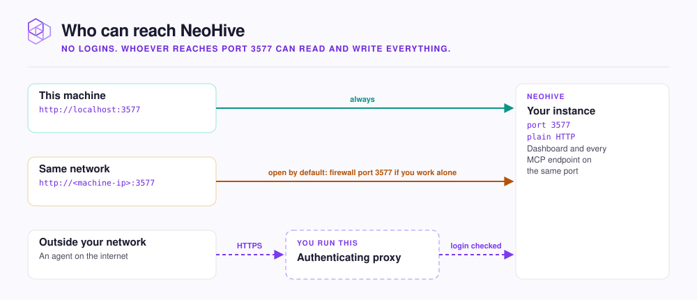

# Access and sharing

Who can reach your NeoHive instance, and how to point a whole team at one shared instance.

NeoHive has no user accounts, roles, or logins. Anyone who can reach port `3577` can read and write everything, and everyone sees the same hives.

<figure><figcaption></figcaption></figure>

## A default install is open to your network

The installer publishes port `3577` on every network interface, not only `localhost`. It prints both addresses when it finishes:

```text
On this machine:    http://localhost:3577
From another host:  http://<this-machine-ip>:3577
```

On shared or public Wi-Fi, anyone on that network can open the second address. If only you use NeoHive, block inbound traffic to port `3577` in your firewall.

## Share one instance with your team

Memory lives on the instance, so a convention one person teaches is recalled by every agent connected to the same hive.



## Install on a shared machine

Pick a host your team reaches over a trusted network, such as a company VPN. Note its address, for example `neohive.internal`.



## Open the dashboard by that address

Each teammate opens `http://neohive.internal:3577`. **Install Instructions** builds its commands from the address in the browser, so they already point at the shared host.



## Connect each agent

Each teammate runs the commands for their agent. The MCP endpoint looks like this:

```text
http://neohive.internal:3577/hives/<hive-id>/mcp
```




**Check:** each teammate's agent calls `list_indexes` and sees the same indexes. **Tool usage** on the hive page counts requests per kind of agent, so two teammates on Claude Code share one bar.


To reach NeoHive from outside a trusted network, put an authenticating proxy in front of it rather than opening the port. See [Exposing NeoHive beyond your network](../security/network.md).

## Next step

Continue to [Test queries in the Playground](playground.md) to check what your hives return before your agents rely on them.
