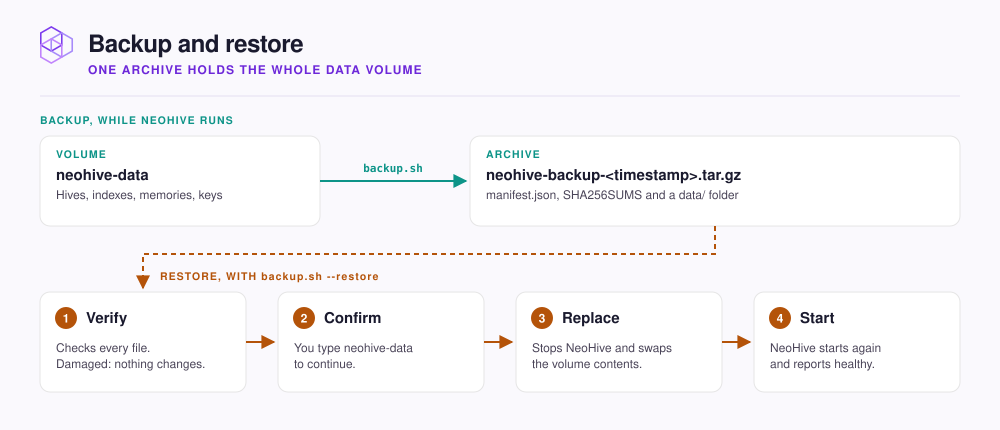

# Backups and restore

Take a backup of a running NeoHive in one command, and restore it when you need to.

Everything NeoHive stores lives in the `neohive-data` Docker volume. The `backup.sh` script copies all of it into one archive while NeoHive keeps running.

<figure><figcaption></figcaption></figure>

| In the archive | Not in the archive |
|---|---|
| Every database: hives, indexes, memories, connections, sync history | The cached license key in `~/.cache/neohive` |
| Every vector index, plus the local copies of your synced repositories | The license-seat file `machine-id` |
| The keys that encrypt your saved GitHub and GitLab credentials | Apple Silicon models in `~/.neohive/models` |


A backup holds your memories, your indexed code, and the keys to your saved credentials. Store it like other private data, and never commit it to a repository.


## Take a backup

Run this on the machine where NeoHive runs. The container must be up.

```bash
curl -fsSL https://raw.githubusercontent.com/NeoHiveAI/install/main/backup.sh | bash
```

It writes `neohive-backup-<timestamp>.tar.gz` to the current folder. To write it elsewhere, pass a folder that exists:

```bash
curl -fsSL https://raw.githubusercontent.com/NeoHiveAI/install/main/backup.sh \
  | bash -s -- --out /path/to/backups
```


**Check:** the script ends with **Backup complete.** and the archive's path.


## Restore from a backup

Restoring replaces everything in the volume. Anything added since the backup is lost. The container must exist, running or stopped.

```bash
curl -fsSL https://raw.githubusercontent.com/NeoHiveAI/install/main/backup.sh \
  | bash -s -- --restore neohive-backup-<timestamp>.tar.gz
```

Type `neohive-data` when asked. `--yes` skips that question, for scripts only.


**Check:** the script ends with **Restore complete.** Open `http://localhost:3577` and your hives are back.


## Move to a new machine

Install NeoHive on the new machine first, so the container exists. Copy the archive across and run the restore there. It reuses the image the new install runs, so it downloads nothing.

<details>

<summary>Optional: non-default container, volume, or port, and Colima or Lima</summary>

| Variable | Default |
|---|---|
| `NEOHIVE_CONTAINER_NAME` | `neohive` |
| `NEOHIVE_VOLUME_NAME` | `neohive-data` |
| `NEOHIVE_PORT` | `3577` |

On Colima or Lima, a restore can stop because the container cannot see the extracted files. Your data is untouched. Set `TMPDIR` to a folder under your home directory, as the error message shows, and run the restore again.

</details>

## Next step

Continue to [Update NeoHive](updating.md). Take a backup before any update.
