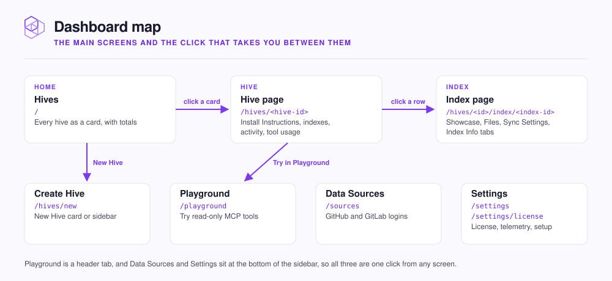

# Dashboard tour

Where each screen of the dashboard lives and what you do there.

The dashboard runs at `http://localhost:3577`.

<figure><figcaption></figcaption></figure>

Two screens appear only while you set up: **Welcome** at `/welcome`, shown until your first hive exists, and the setup wizard at `/setup`. Rerun the wizard from **Settings** with **Run setup wizard**.

## The home screen

**Hives** shows every hive as a card, with **Total Memories**, **Added via MCP** and **Queries (30d)** along the top. Switch on **Trends** to add a 30-day line under each total.

- **Pin** up to two hives to keep them in a **Pinned** row at the top.
- **Drag** the other cards to reorder them.
- **Open a card's menu** for **Edit**, **Pin**, **Copy MCP command**, **Stop**, **Start** or **Restart**, **Archive** and **Delete**.

## The hive page

**Install Instructions** at the top gives ready-made commands for Claude Code, Claude Desktop, Codex and Cursor. It collapses once an agent connects; **Reinstall** opens it again.

| Section | What it shows |
|---|---|
| **AT A GLANCE** | **Memories**, **Learnings 7d**, **Queries 7d**, **Last activity** |
| Activity | **Recent learnings**, **Recent queries**, **All activity** |
| **Indexes** | Every index in the hive, including **Shared Indexes** from other hives. **+** adds one; each row's menu holds its actions |
| **Tool usage** | Requests per kind of agent, such as Claude Code or Cursor |
| **Sync Queue** | Syncs running or waiting |

A red **An Index stopped syncing** banner at the top names any index whose sync failed, with the reason.

## The index page

The top shows **Memories**, **Files**, **Last sync** and **On disk**. A GitHub or GitLab index also has **Trigger sync**.

| Tab | Shown for | What's there |
|---|---|---|
| **Showcase** | Every index | A preview of what the index holds |
| **Files** | Files indexes | Uploaded files and a drop zone for more |
| **Sync Settings** | Code and Documentation indexes | **Sync history**, then connection, branch, **Sync interval**, file filters, and **Pause syncing** |
| **Index Info** | Every index | Name, description, embedding model, **Share Index…**, **Move Index…**, **Danger zone** |

A new embedding model, the program that turns text into numbers for search, re-embeds every memory in the background. A banner shows progress while it runs.

## Keyboard shortcuts

| Keys | Action |
|---|---|
| `Cmd+K` or `Ctrl+K`, or `/` | Search palette: jump to a hive, a connection, **Data Sources** or **Settings** |
| `G` then `D` | Home screen |
| `G` then `S` | **Settings** |
| `Cmd+B` or `Ctrl+B` | Show or hide the sidebar |
| `?` | All shortcuts |

## Next step

Continue to [Manage hives and indexes](manage.md) to archive, move, share, or delete them.
