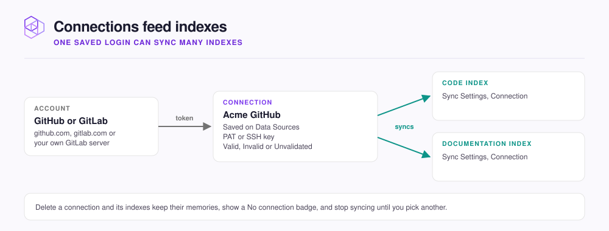

# Data sources and credentials

How to add a GitHub or GitLab connection, check that it still works, and replace it without breaking sync.

A connection is a saved login that lets NeoHive read repositories from one account. Open **Data Sources** at the bottom of the sidebar, or go to `http://localhost:3577/sources`.

<figure><figcaption></figcaption></figure>

| Service | Use it for | Credential |
|---|---|---|
| **GitHub** | Repositories on `github.com` | Personal access token or SSH private key |
| **GitLab** | Repositories on `gitlab.com` or your own GitLab server | Personal access token or SSH private key |
| **Jira** | Nothing yet: the card shows **Coming soon** | None |

## Add a connection



## Open the form

Under **Available**, click **Install** on the **GitHub** or **GitLab** card. You can also pick **Add a new connection** from the **Connection** list while you add an index.



## Fill it in

| Field | What to enter |
|---|---|
| **GitLab Base URL** | GitLab only. Your server, such as `https://gitlab.example.com`. Leave it blank for `gitlab.com` |
| **Name** | A label, such as `Acme GitHub`. Each name is used once per service |
| **PAT** or **SSH** | Paste a **Personal Access Token**, or switch to **SSH** and paste an **SSH Private Key** |

**Create a PAT** opens the token page with the right scopes ticked: `repo` on GitHub, `read_api` and `read_repository` on GitLab.



## Save it

Click **Save connection**. NeoHive checks the token with the service first, and a rejected token is not saved. If the same token or account is already saved, the form warns you; **Add anyway** keeps both.




**Check:** the service now appears under **Connected**, and **Manage** lists your connection as **Valid**.


## Check or remove a connection

Click **Manage** on a card under **Connected**.

| State | Meaning |
|---|---|
| **Valid** | The last check passed |
| **Invalid** | The service rejected the credential. Replace it |
| **Unvalidated** | Saved but not confirmed yet. Click **Validate** to check now |

**Bound Indexes** lists the indexes in your current hive that sync through the connection. **Delete** removes the connection.


To swap a token without a gap in syncing, add the new connection first. On each affected index, open **Sync Settings**, pick it under **Connection**, and click **Save settings**. Then delete the old one.


How NeoHive stores these secrets is on [Credentials and secrets](../security/credentials.md).

## Next step

Continue to [Access and sharing](access.md) to decide who can reach your NeoHive instance.
