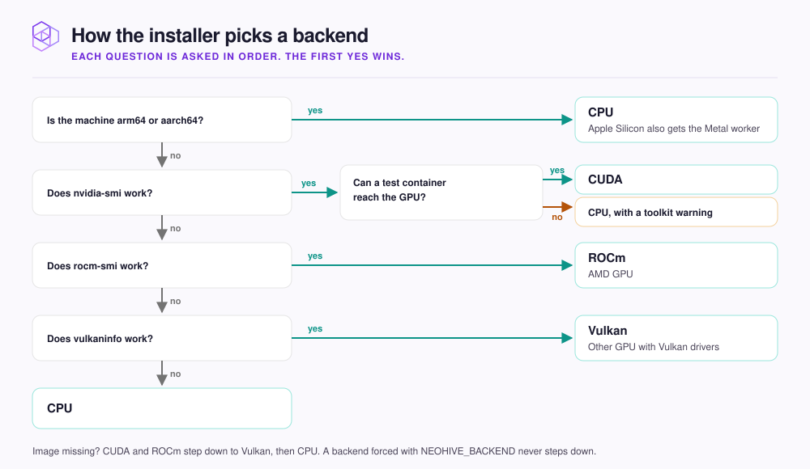

# GPU and CPU

Which hardware backend NeoHive picks on your machine, how to confirm it, and how to change it.

A GPU makes indexing large repositories faster. Day-to-day recall is fast on any backend, and CPU runs everywhere.

<figure><figcaption></figcaption></figure>


**Check:** see which backend is running.

```bash
docker ps --filter name=neohive
```

The tag in the `IMAGE` column names the backend, for example `neohivedev/neohive:cuda`, or `v1.6.3-cpu` for a versioned image.


## Apple Silicon uses the GPU anyway

Docker on a Mac cannot reach the GPU, so the container runs on CPU. On Apple Silicon the installer also sets up a native worker that runs embedding, the step that turns text into numbers for search, on the Mac's Metal GPU. Indexing gets much faster.

- **It runs outside Docker,** from `~/.neohive/metal-worker/`, and starts again after a reboot.
- **It listens on `127.0.0.1` only,** port `50051` by default, so nothing is exposed to your network.
- **Models download to `~/.neohive/models/`** on first use. Logs go to `~/.neohive/logs/`.
- **If any part fails,** the installer warns you and NeoHive embeds on CPU inside the container.

The end of the install output says which you got: `Embedding: native Metal worker on 127.0.0.1:50051`, or `Embedding: in-container CPU (no Metal worker)`.

| Variable | Default | Effect |
|---|---|---|
| `NEOHIVE_METAL_WORKER` | `1` | `0` skips the worker and keeps CPU embedding in the container |
| `NEOHIVE_METAL_WORKER_PORT` | `50051` | Change it if another program already uses that port |

## Force a backend

If detection picks the wrong backend, or a GPU backend will not start, set `NEOHIVE_BACKEND` to `cpu`, `cuda`, `vulkan`, or `rocm`:

```bash
NEOHIVE_BACKEND=cpu \
  bash <(curl -fsSL https://raw.githubusercontent.com/NeoHiveAI/install/main/install.sh)
```

A forced backend has no fallback: if its image cannot be downloaded, the install stops with an error. Set the variable again on every update, because the installer does not remember it.

## NVIDIA GPU but NeoHive runs on CPU

`nvidia-smi` on the host is not enough. The container reaches the GPU through the [NVIDIA Container Toolkit](https://docs.nvidia.com/datacenter/cloud-native/container-toolkit/latest/install-guide.html). Without it, the installer's test container fails and it warns `NVIDIA Container Toolkit probe failed - falling back to CPU backend.`

This happens most on Docker Desktop and WSL2. Install the toolkit, restart Docker, and run the installer again.

## Next step

Continue to [Uninstall](uninstall.md) if you need to remove NeoHive from a machine.
