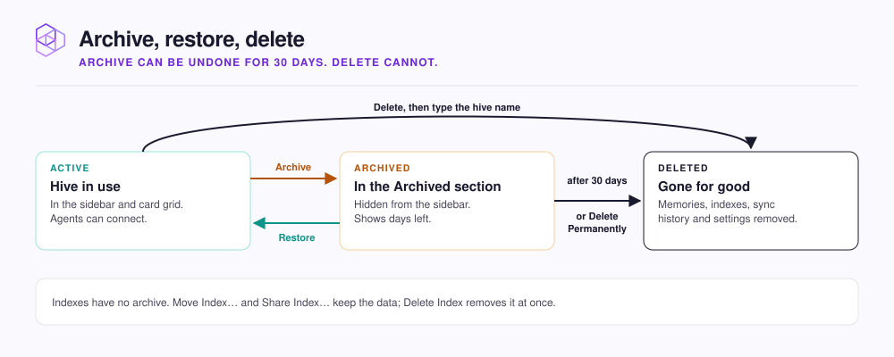

# Manage hives and indexes

Which action to use on a hive or an index, where to find it, and whether you can undo it.

| Action | Applies to | Where | Undo |
|---|---|---|---|
| **Archive** | Hive | Hive card menu, or the menu next to its name in the sidebar | **Restore**, within 30 days |
| **Delete** | Hive | Same menu | None |
| **Move Index…** | Index | Index row menu on the hive page, or the **Index Info** tab | Move it back |
| **Share Index…** | Index | Same places | **Revoke** |
| **Shared Index** | Another hive's index | **+** on the **Indexes** list | **Remove from Hive…** |
| **Delete Index** | Index | **Index Info** tab, under **Danger zone** | None |

## Archive, restore, or delete a hive

<figure><figcaption></figcaption></figure>

**Archive** moves the hive to the **Archived** section at the bottom of the home screen, which counts down the days left. Expand **Archived** and click **Restore** to bring it back with its indexes and memories.

**Delete** asks you to type the hive's name, then **Delete permanently** removes every memory, index, sync history, and setting. For an archived hive, **Delete Permanently** then **Confirm** does the same.

## Move an index to another hive

Choose **Move Index…**, pick a hive under **Move to**, and click **Move Index**. Only running hives are offered. Both hives pause briefly while the data moves, then resume on their own.

## Share an index between hives

A Shared Index is one index that several hives search, so a repository is indexed once. Set one up from either side:

- **Offer it:** on the owning hive, choose **Share Index…**, pick a hive under **Add a Hive**, and click **Share**.
- **Take it:** on any hive, click **+** on **Indexes**, choose **Shared Index**, pick an index, and click **Add shared Index**. The owning hive does not have to approve.


Every hive that uses a Shared Index can sync it, change its embedding model and connection, and delete its memories. There is one index, so each change reaches every hive. Only your agent's own writes stay separate: `memory_store` always writes to the hive's own Knowledge index.


The borrowing hive sees a **Shared** badge on the row. **Owner Hive** in the row menu, or **Open in** on **Index Info**, opens the owning hive.

To end a share, the owner clicks **Revoke** in **Share Index…**, or the borrower chooses **Remove from Hive…**. Neither deletes anything. The owner cannot delete a shared index until every share is revoked.

## Delete an index

**Delete repository** on the **Sync Settings** tab of a Code or Documentation index stops syncing and deletes its memories but keeps the empty index. **Delete Index** removes the index itself.

## The Knowledge index stays with its hive

Every hive has one Knowledge index, where your agent's memories live. You cannot move, share, rename, or delete it on its own. It goes wherever its hive goes, including into the archive.

## Next step

Continue to [Data sources and credentials](data-sources.md) to connect the accounts your Code and Documentation indexes sync from.
