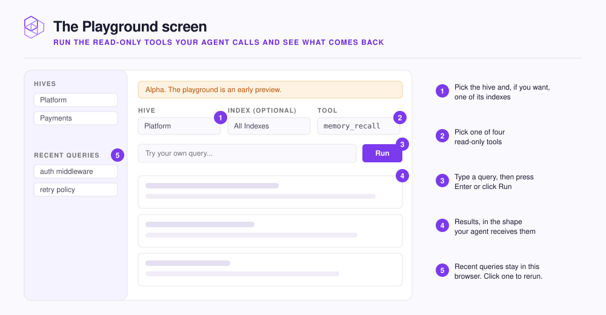

# Test queries in the Playground

Run the same read-only tools your agent calls, from the dashboard, and see exactly what comes back.

Open **Playground** in the header bar, or click **Try in Playground** on a hive page to arrive with that hive picked. The screen is marked **Alpha**, an early preview.

<figure><figcaption></figcaption></figure>

| Tool | Needs a query | What it returns |
|---|---|---|
| `memory_recall` | Yes | The memories and indexed content that best match |
| `memory_context` | Yes | **DIRECTIVES**, **CONVENTIONS** and **TASK RELEVANT**: what an agent loads at the start of a task |
| `list_indexes` | No | Every index the hive can search |
| `memory_stats` | No | **Total memories**, **Top types**, **Recent growth** |

Nothing you run here adds, changes, or deletes a memory. Running `list_indexes` is also a quick way to test a hive before any agent is connected.

## Run a query



## Pick the scope

Choose a **Hive**. Leave **Index (optional)** on **All Indexes (cross-index fan-out)** to search the whole hive, as your agent does, or pick one index. Shared Indexes are included.



## Pick the tool

Choose a **Tool**. `memory_recall` is the default.



## Run it

For `memory_recall` or `memory_context`, type into **Try your own query...** and press `Enter` or click **Run**. The other two tools only need **Run**.




**Check:** recall something you know is in the hive; it comes back near the top. If you get **No memories matched this query.**, see [Recall isn't finding what I need](../troubleshooting/recall.md).


## Use it to tune your prompts

Try one question phrased two or three ways and compare. The Playground calls the same retrieval your agent does, so phrasing that works here works there.

Narrow to one index to tell missing content from content another index outranks. If one index returns it and **All Indexes** does not, the content is there.

## What it leaves alone

Playground runs do not count toward the query totals on the home screen or the hive page.

Each run is saved under **Recent queries** in the sidebar. Click one to load it back, or **Clear** to empty the list. The list lives in your browser, so teammates do not see it.

<details>

<summary>Optional: link straight to a prepared query</summary>

The Playground reads its settings from the address, so a link can open with everything filled in:

```text
http://localhost:3577/playground?hive=<hive-id>&tool=memory_recall&query=auth%20middleware
```

Add `index=<index-id>` to narrow it to one index.

</details>

## Next step

Continue to [Backups and restore](backups.md) to protect what your hives hold.
