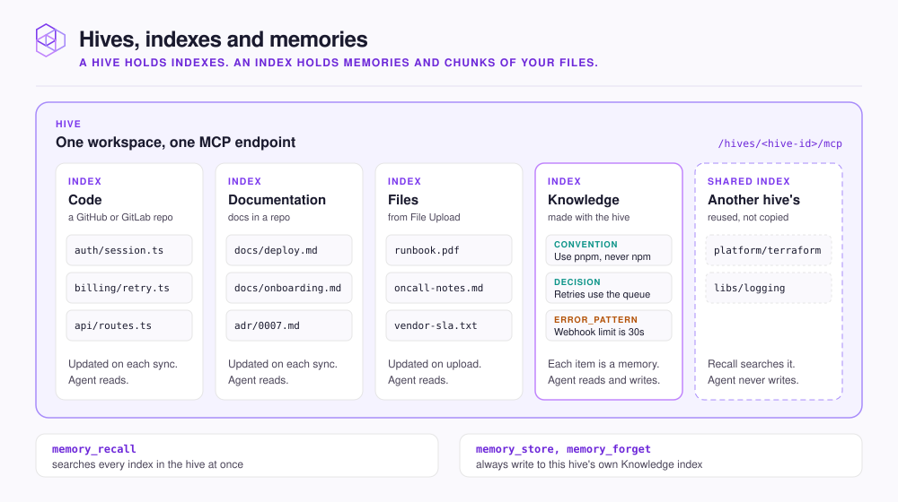

# Hives, indexes and memories

You learn the three levels NeoHive uses, and where each piece of your context lands.

<figure><figcaption></figcaption></figure>

## Hives

A hive is a workspace: it keeps the context for one codebase or team apart from unrelated work. You create hives in the dashboard at `http://localhost:3577`. Each hive has one MCP endpoint, `/hives/<hive-id>/mcp`, and every agent connected to it sees the same context.

Put closely related code, such as the services in one monorepo, in one hive. Keep unrelated codebases in separate hives.

## Indexes

An index holds one kind of context inside a hive. Each index has its own storage and its own embedding model, the model that turns text into embeddings.

| Index | Filled from | Who writes to it |
|---|---|---|
| **Code** | A GitHub or GitLab repository | NeoHive, on every sync |
| **Documentation** | Docs in a GitHub or GitLab repository | NeoHive, on every sync |
| **Files** | `.md`, `.markdown`, `.txt` and `.pdf` files you add with **File Upload** | NeoHive, on upload |
| **Knowledge** | What your agents learn as you work | Your agents, through `memory_store` |

Every hive gets one Knowledge index when you create it. You cannot add a second one.

Your agent never has to pick an index. One `memory_recall` searches every index in the hive and returns code, docs and memories together.

## Shared Index

A **Shared Index** is a Code, Documentation or Files index that another hive set up, added to yours without copying or indexing it again. Recall searches it. Your agents never write to it: `memory_store` and `memory_forget` always go to your own Knowledge index.


There is one index, not a copy. In the dashboard, a hive that shares it can sync it, change its connection and embedding model, and delete its content, and every change applies to both hives. Knowledge indexes cannot be shared. See [Manage hives and indexes](../admin/manage.md).


## Memories

A memory is one stored piece of knowledge in a Knowledge index: a convention, a decision, a gotcha, a correction. Your agent stores one when you ask it to remember something, or when it finds something worth keeping.

| A memory has | What it is |
|---|---|
| A type | Such as `directive`, `convention`, `decision` or `error_pattern`, picked by your agent. See [Memory types](../reference/memory-types.md) |
| Tags | Words that help later searches find it |
| An importance | From 1 to 10, default 5 |

When a memory goes stale, your agent calls `memory_forget`. That deactivates the memory rather than deleting it, and can name the memory that replaces it.

Code, Documentation and Files indexes hold chunks instead of memories. A chunk is a section of a file, such as a function or a heading and its text.

## Next step

Continue to [How retrieval works](retrieval.md).
