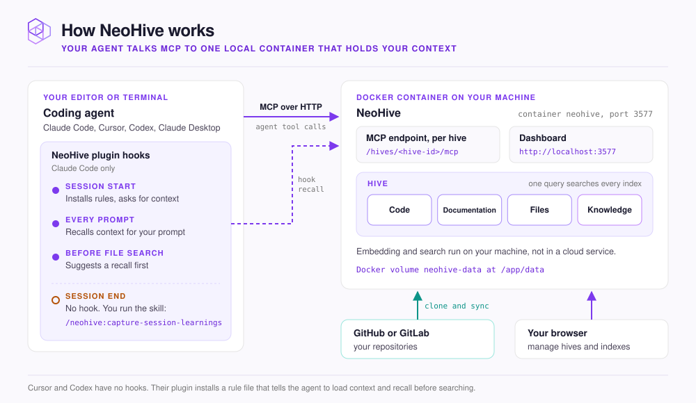

# How NeoHive works

You see what runs where, and what talks to what.

<figure><figcaption></figcaption></figure>

NeoHive is one Docker container named `neohive` on your machine. It serves the dashboard at `http://localhost:3577` and one MCP endpoint per hive at `/hives/<hive-id>/mcp`. Your data lives in the `neohive-data` Docker volume, mounted at `/app/data`.

## The three parts

| Part | Where it runs | What it does |
|---|---|---|
| Your agent | Your editor or terminal | Calls NeoHive tools such as `memory_recall` and `memory_store` over MCP, the standard protocol agents use to call tools |
| The NeoHive plugin | Inside Claude Code, Cursor or Codex | Adds rules that tell the agent when to use memory. In Claude Code it also adds hooks, scripts that run at fixed points in a session |
| The NeoHive container | Docker, on your machine | Stores your hives and indexes, finds context for each question, and syncs repositories |

Your agent never reads NeoHive's files. It asks through an MCP tool, and the container answers with matching code, docs and memories.

Claude Desktop and other MCP apps have no plugin. They connect to the same MCP endpoint and call the same tools.

## Hooks in Claude Code

The Claude Code hooks call the container themselves. The prompt hook sends your prompt to `memory_recall` and adds the results to the agent's context before the agent starts its answer. Nothing runs when a session ends: run `/neohive:capture-session-learnings` to save what the session taught.

Cursor and Codex have no hooks. Their plugin installs a rule file that tells the agent to load context at the start of a session and to recall before searching files. [What the plugin does automatically](../results/plugin-automation.md) lists every hook and the switch that turns it off.

## Repositories

When you add a repository, the container clones it from GitHub or GitLab into its volume. It splits the files into chunks (sections such as a function or a heading and its text), turns each chunk into an embedding, and stores them in an index.

An embedding is a list of numbers that captures what text means. Later syncs index again only the files that changed.

Embedding and search run on your machine. [What stays on your machine](../security/local-only.md) lists every connection the container makes to the outside.

## Next step

Continue to [Hives, indexes and memories](hives-indexes-memories.md).
