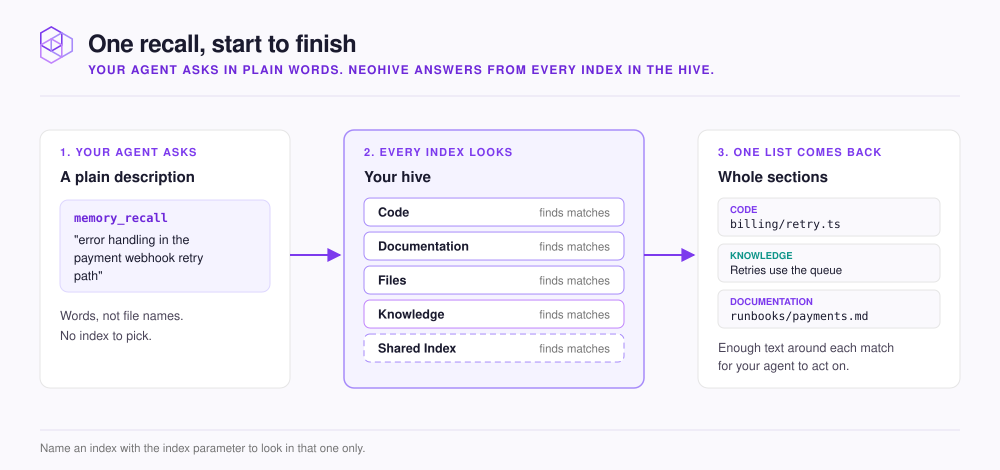

# How retrieval works

You see what one recall does for your agent, and how you can steer it.

<figure><figcaption></figcaption></figure>

Your agent does not grep for file names or read files top to bottom. It describes what it needs, and NeoHive finds context that matches the meaning of that description. An exact function name or error code in the query still finds the text that contains it.

When a small part of a file matches, NeoHive returns the whole section it belongs to, so your agent gets enough text to act on. Indexes with nothing relevant add nothing to the list.

## Two ways to ask

| Tool | Use it for |
|---|---|
| `memory_context` | The start of a task. It returns the directives and conventions that match the task you describe, plus other memories that match it |
| `memory_recall` | A specific question in the middle of a task |

Both search every index in the hive unless you name one.

## What you control

The order of results is automatic. You steer recall through what you ask and where you ask it.

| `memory_recall` parameter | What it does |
|---|---|
| `query` | One search, written as a statement with the words you expect in the answer |
| `queries` | Up to five phrasings of the same need in one call. Results that match several phrasings appear higher in the list. Use `query` or `queries`, not both |
| `index` | Searches one index only. Faster and more focused when you know where the answer lives |
| `types` | Returns only memories of the listed types, such as `directive` and `convention` |
| `limit` | How many results come back. Default 10, maximum 50 |

Search the whole hive first to see which index answers best. Then repeat the query with `index` set to that index.

Phrasing matters. `GitHub Actions concurrency limit workaround` finds more than `how do I fix GitHub Actions`. [Write prompts that retrieve well](../results/prompting.md) covers this.


How NeoHive orders results is internal and can change between releases. Do not write rules or prompts that depend on a particular order. How you phrase the query is what stays stable.


## Next step

Keep the terms straight with the [Glossary](glossary.md).
