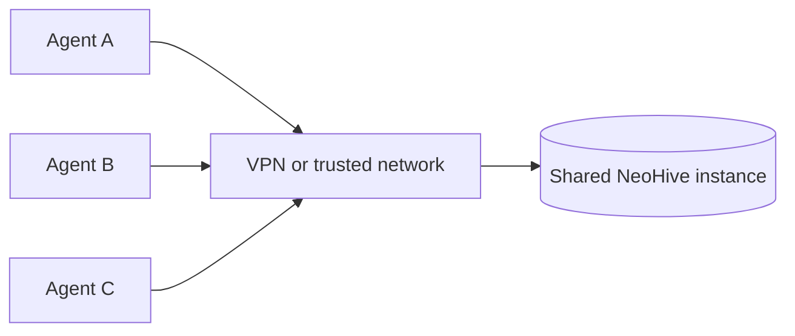

# Access & sharing

NeoHive is built to be shared by a team, and the way it handles access reflects that. This page explains who can reach an instance, how to run one for your whole team, and what to do before exposing it beyond a trusted network.

## How access works today

NeoHive has no built-in user accounts. Anyone who can reach the dashboard and the MCP endpoint has full access to that instance, and everyone who connects sees the same projects and the same memory. There are no per-user logins, roles, or permissions.

The practical consequence is that the network is your access control. An instance should be reachable only by the people who should be able to use it.


NeoHive does not authenticate individual users. Treat "can reach the instance over the network" as "can read and write everything in it," and keep an instance on a network only your team can access.


## Running it for yourself

A default install listens on `http://localhost:3577` and is reachable only from your own machine. Nothing else can see it unless you deliberately expose it. For solo use, there is nothing more to set up.

## Sharing it with your team

Run one instance on a machine your team can reach over a trusted network, and have everyone point their agent at that same endpoint. A company VPN is the setup NeoHive is designed for. Because memory lives on the instance rather than in each person's client, a convention one person teaches or a repository one person indexes is immediately available to everyone connected to the same project.

To make an instance reachable, run it on a host your team can route to and connect using that host's address in place of `localhost`, for example `http://neohive.internal:3577/hiveminds/<project-id>/mcp`. The exact address depends on your network.

## Exposing NeoHive beyond your network

To reach an instance from outside a trusted network, put an authenticating layer in front of it instead of opening the port directly. A reverse proxy such as Cloudflare, or a VPN gateway, can require a credential and terminate TLS before any traffic reaches NeoHive. This is also where HTTPS comes from: NeoHive serves plain HTTP, so the certificate is provided by your proxy, not by NeoHive.

When your proxy requires a credential, pass it from your agent with the [`NEOHIVE_TOKEN`](../reference.md) environment variable, and use the `https://` address your proxy exposes. This setup is specific to your proxy and network, so treat it as part of your own infrastructure rather than a NeoHive feature.
