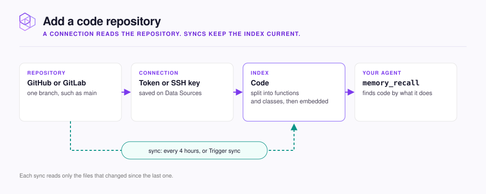

# Add a code repository

Connect a repository once and your agent can find code by what it does, kept current by scheduled syncs.

<figure><figcaption></figcaption></figure>

Your agent asks `how does the sync engine handle retries?` and gets back the functions that do it, even when those words never appear in the file. Code results come back in the same answer as your team's stored conventions and decisions.

| Task | Page |
|---|---|
| Save a connection, pick the repository and branch, create the index | [Connect GitHub or GitLab](connect.md) |
| Keep generated code, fixtures, and other noise out | [Choose which files are included](file-patterns.md) |
| Set the sync schedule, sync on demand, read the sync history | [Keep it up to date](sync.md) |

**You need:** a hive, read access to the repository, and a personal access token or SSH key for it.

The code is cloned and embedded on the machine that runs NeoHive and is never sent to an outside service. See [What stays on your machine](../../security/local-only.md).


The first sync reads every file: a few minutes for a typical service, longer for a large monorepo. Later syncs read only files that changed. A GPU makes indexing faster; see [GPU and CPU](../../admin/gpu-cpu.md).


## Next step

Start with the connection. Continue to [Connect GitHub or GitLab](connect.md).
