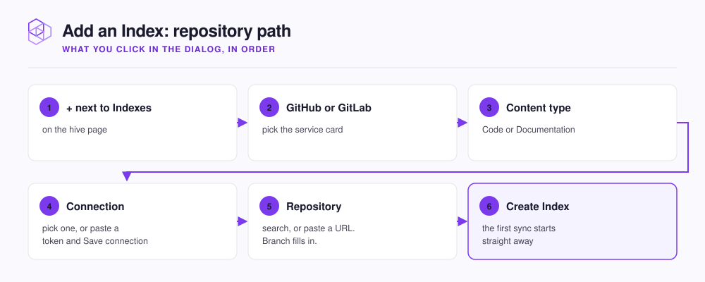

# Connect GitHub or GitLab

Create a token, save it as a connection, pick the repository, and click **Create Index**. The first sync starts on its own.

<figure><figcaption></figcaption></figure>

## Create a token

The connection form has a **Create a PAT** link that opens your provider's token page with the name and scopes filled in.



Create a classic personal access token with the `repo` scope. It starts with `ghp_`.

```text
https://github.com/settings/tokens/new?scopes=repo&description=NeoHive
```



Create a personal access token with the `read_api` and `read_repository` scopes. It starts with `glpat-`.

```text
https://gitlab.com/-/user_settings/personal_access_tokens?name=NeoHive&scopes=read_api,read_repository
```

For a self-hosted GitLab, enter your instance's address in **GitLab Base URL** first. The **Create a PAT** link then opens your own instance. Leave the field blank for `gitlab.com`.



Choose the **SSH** tab in the connection form and paste a private key into **SSH Private Key**. The key needs read access to the repository, for example as a deploy key.



## Fill in the dialog

Open your hive at `http://localhost:3577`, click **+** next to **Indexes**, pick **GitHub** or **GitLab**, and choose **Code**.

| Field | What to do |
|---|---|
| **Connection** | Pick a saved connection. With none saved, the form opens: enter a **Name** such as `Acme GitHub`, paste the token, and click **Save connection**. |
| **Repository** | Pick from the list, or type into **Search repositories or paste a URL...**. A repository the list does not show appears as a **Use owner/repo** row. |
| **Index name** | Fills in from the repository, such as `acme/api`. It must be unique in the hive. |
| **Branch** | Fills in with the repository's default branch. Pick another from the list if you need one. |

Click **Create Index**. NeoHive opens the new index page, clones the repository, and starts the first sync. Progress shows in the page header.

NeoHive checks a token when you save it and refuses one the provider rejects. If you already saved that token or that account, it warns you and offers **Add anyway**.


**Check:** open the index's **Sync Settings** tab. **Sync history** shows the first run, and its status reads `success` when it finishes.


## After you create it

Open the **Index Info** tab and fill in **Description**. Your agent reads it through `list_indexes`, so name what the repository covers: `Billing and payments services: Stripe webhooks, retries, nightly reconciliation` rather than `repo index`.

<details>
<summary>Optional: switch to a code-specialised embedding model</summary>

A new Code index uses a general text model. **Embedding model** on the **Index Info** tab also offers **Nomic Embed Code** models, which match code more closely but need a lot of GPU memory. Each option is marked **Fits** or **Won't fit** for your machine. Saving a new model re-embeds the whole index in the background. See [GPU and CPU](../../admin/gpu-cpu.md).

</details>

Saved connections are listed on **Data Sources**; see [Data sources and credentials](../../admin/data-sources.md).

## Next step

Keep noise out of the index before it grows. Continue to [Choose which files are included](file-patterns.md).
