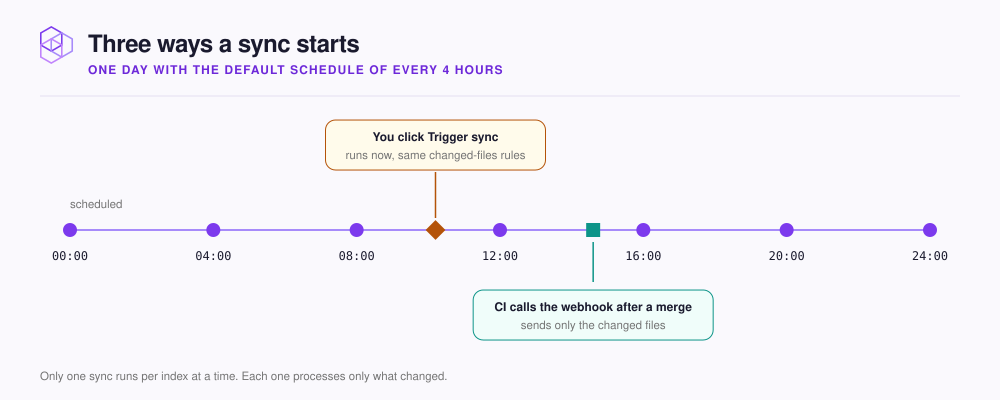

# Keep it up to date

Pick a sync schedule, click **Trigger sync** when you need a change now, and read **Sync history** when something looks wrong.

<figure><figcaption></figcaption></figure>

Each sync reads only what changed since the last indexed commit: new, modified, and renamed files are indexed again, and deleted files are removed.

## Set the schedule

On the index's **Sync Settings** tab, pick a **Sync interval** under **Configuration** and click **Save settings**. Syncs run at fixed times of day: **Every 4 hours** runs at 00:00, 04:00, 08:00, and so on.

| **Sync interval** | Good for |
|---|---|
| **Every 15 minutes**, **Every 30 minutes** | A busy repository where your agent needs changes quickly |
| **Every hour** | Most repositories |
| **Every 4 hours** | The default for a new index |
| **Daily** | A repository that rarely changes |

The same card sets the **Branch** and the **Connection**. **Pause syncing** stops scheduled syncs without deleting anything, and **Resume syncing** starts them again.

## Sync now

Click **Trigger sync** at the top of the index page. The first time, a **Sync Warning** asks you to confirm with **I Understand**.

Progress shows in the page header, with a button to cancel. A manual sync also gives files that failed several times in a row one more try.

To sync right after every merge, call the webhook from your CI. See [Webhook refresh endpoint](../../reference/webhooks.md).

## Read the sync history

**Sync history** sits at the top of the **Sync Settings** tab, newest run first.

| Column | Tells you |
|---|---|
| **Time**, **Duration** | When the run started and how long it took |
| **Status** | `running`, `success`, `failed`, or `cancelled`. An amber `partial` means some files failed |
| **Files** | Files added, modified, deleted, and renamed, such as `+12A / ~3M` |
| **Progress**, **Chunks** | Files done out of the total, and pieces added or removed |
| **Commit Range** | The commits between the previous run and this one |
| **Error** | What went wrong. Click it to read the full message |

If the branch is renamed, such as `master` to `main`, the sync follows it when the match is clear, and otherwise asks you to pick a branch. For runs that keep failing, see [Repository sync issues](../../troubleshooting/sync.md).

## Next step

Your code is in. Add the documents that do not live in git. Continue to [Add documents and PDFs](../documents.md).
