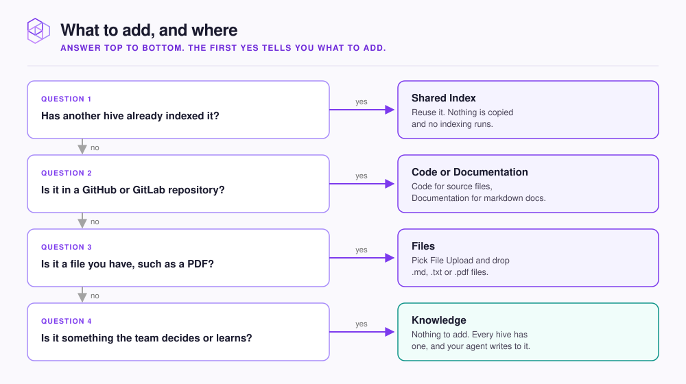

# What to add, and where

Find the index that fits your content, then decide whether it goes in an existing hive or a new one.

<figure><figcaption></figcaption></figure>

## Pick the index

Open your hive in the dashboard at `http://localhost:3577` and click **+** next to **Indexes**. The **Add an Index** dialog asks where your data comes from.

| Your content | In the dialog | Index you get |
|---|---|---|
| Source code in a repository | **GitHub** or **GitLab**, then **Code** | **Code**, kept in sync with the branch |
| Markdown docs in a repository | **GitHub** or **GitLab**, then **Documentation** | **Documentation**, kept in sync with the branch |
| Specs, runbooks, or PDFs outside git | **File Upload** | **Files**, filled by uploading |
| Conventions and decisions your team makes | Nothing to add | **Knowledge**, created with every hive |
| An index another hive already set up | **Shared Index**, under **or reuse an existing Index** | The same index, searchable here with no copy |

[Add a code repository](repositories/README.md) covers both repository kinds. A Documentation index still reads every file the filters let through, so give it an **Allowlist** such as `**/*.md` ([Choose which files are included](repositories/file-patterns.md)).

Jira shows as a **Coming soon** card and cannot be added yet.


Your agent searches every index in the hive with one query. When it wants one index, it chooses by the descriptions it reads through `list_indexes`. Set each description on the index's **Index Info** tab and name the services, domains, and languages it covers.


## Decide how many hives

Each hive has its own MCP endpoint and its own **Knowledge** index, so what your agent learns in a hive stays in it.

| Situation | Do this |
|---|---|
| One product, one repository | One hive |
| One product across several repositories | One hive, one Code index per repository |
| Unrelated products or teams | One hive each, so results from one codebase do not crowd out the other |
| A library several products use | Index it in one hive, then add it to the others as a **Shared Index** |

A **Shared Index** can be a Code, Documentation, or Files index, never a **Knowledge** index. Your agent can recall from it but not write to it.


A shared index is one index, not a copy. Anyone who changes its settings or syncs it from any hive changes it for every hive that uses it.


## Next step

Most teams start with their code. Continue to [Add a code repository](repositories/README.md).
