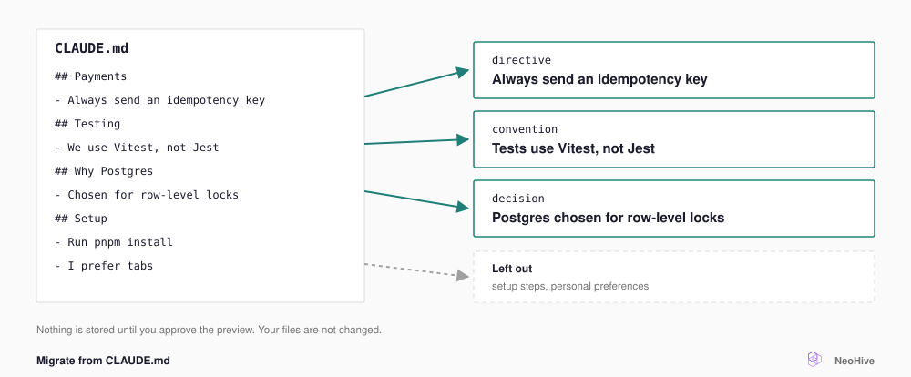

# Migrate from CLAUDE.md

Run one skill to turn the project rules in your context files, such as `CLAUDE.md`, into [Memories](../reference/glossary.md#memory) (stored pieces of team knowledge). Every agent connected to your [Hive](../reference/glossary.md#hive) can then recall those Memories.

<figure><figcaption></figcaption></figure>

Your agent loads all of `CLAUDE.md` on every task, even the parts that do not apply. After you migrate, your agent recalls only the rules that matter for the current task.

## Run the migration

To start the migration, do the following:

1. Open your agent in the root folder of the project.
2. Run the skill, as shown for your agent in the following tabs.



```
/neohive:migrate-memory
```

The skill reads the following files:

* `CLAUDE.md`, `AGENTS.md`, and `GEMINI.md`
* The `.md` files in `.claude/rules/`
* Any `CONVENTIONS*.md` or `CONTRIBUTING.md` under `docs/`

The skill never imports `~/.claude/CLAUDE.md`, which holds your personal preferences.



Ask your agent to run the `migrate-memory` skill.

The skill reads the following files:

* `CLAUDE.md`, `AGENTS.md`, and `GEMINI.md`
* The `.md` and `.mdc` files in `.cursor/rules/`, `.codex/rules/`, and `.claude/rules/`
* Any `CONVENTIONS*.md` or `CONTRIBUTING.md` under `docs/`

The skill never imports `~/.codex/AGENTS.md`, `~/.claude/CLAUDE.md`, or `~/.cursor/rules/`, which hold your personal preferences.





## The skill lists the files

The list shows each project file that the skill reads. Files in your home folder appear as skipped, because the skill reads them for context only.



## The skill splits and classifies

The skill turns each rule or decision into its own Memory and gives each Memory a type, such as `directive`, `convention`, or `decision`. The skill leaves out setup steps, tables of contents, TODO lists, and personal preferences. If an entry could be either a personal rule or a team rule, the skill marks it as ambiguous. The skill skips ambiguous entries unless you re-classify them.



## You confirm

If the Hive has more than one [Index](../reference/glossary.md#index), the skill asks which Index to use. Select **Knowledge**. The `memory_store` tool always writes to the Hive's [Knowledge Index](../reference/glossary.md#knowledge-index), whichever Index you name.

The skill then shows a preview table of what it plans to store and what it skipped. The skill writes nothing until you approve. You can remove items, re-classify the ambiguous ones, or stop the migration.



## The skill stores the Memories

The skill skips any Memory that the Hive already holds. The skill stores the rest in the Hive's Knowledge Index, and then shows a summary of what it migrated.



To approve each Memory one at a time, add `review=each` to the command: `/neohive:migrate-memory review=each`.

The skill does not change your original files. The skill also skips the block between the `<!-- BEGIN neohive-managed v=N -->` and `<!-- END neohive-managed v=N -->` markers. The NeoHive plugin writes that block, for example when you run `/neohive:generate-claude-md`. The block must stay in the file.

## After migrating

Your agent recalls migrated rules like any other Memory. A teammate on the same Hive gets the same rules without copying your `CLAUDE.md`. If a rule migrated incorrectly or becomes out of date, tell your agent. Your agent then retires the old Memory. For details, see [Capture team knowledge](team-knowledge.md#correct-what-goes-stale).


Long-form notes, such as an Obsidian vault, design docs, or runbooks, belong in a [Files Index](../reference/glossary.md#files-index). See [Add documents and PDFs](documents.md).


## Next step

Your rules are now in NeoHive. Continue to [A session, start to finish](../get-better-results/a-session.md) to see how your agent uses those rules.
