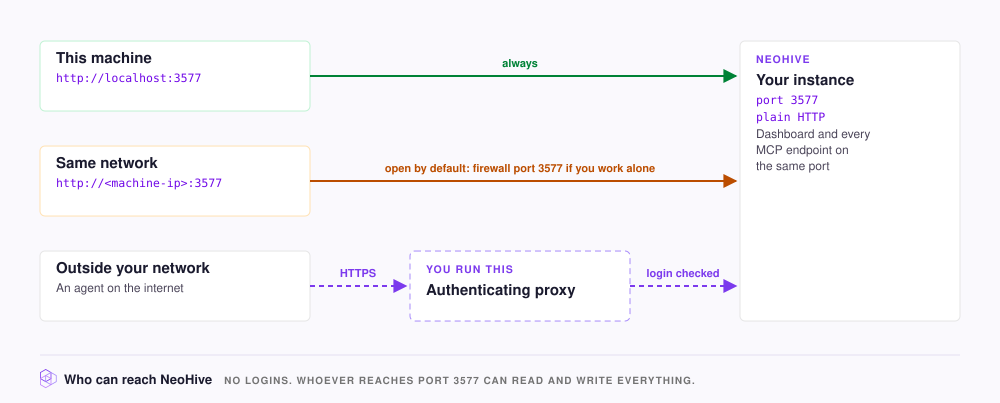

# Access and sharing

NeoHive runs on one machine, and anyone who can reach that machine on NeoHive's port, `3577` by default, can read and write every [Hive](../concepts/glossary.md#hive) on it. Check who can reach the machine before you install NeoHive on a network that other people use.

To give your whole team one shared instance, install NeoHive on a machine that everyone reaches over a trusted network.

For more terms, see the [NeoHive glossary](../concepts/glossary.md).

<figure><figcaption></figcaption></figure>

## A default install is open to your network

The installer publishes NeoHive's port on every network interface, not only on `localhost`. When the install finishes, the installer prints both addresses, for example:

```text
On this machine:    http://localhost:3577
From another host:  http://192.168.1.20:3577
```

On shared or public Wi-Fi, anyone on that network can open the second address. If only you use NeoHive, block inbound traffic to NeoHive's port at your network firewall: `3577` by default, or the port you set with `NEOHIVE_PORT`. For more information about blocking the port, see [Exposing NeoHive beyond your network](../security/network.md#the-default-install-is-reachable-from-your-network).

## Share one instance with your team

NeoHive stores [Memories](../concepts/glossary.md#memory) on the instance. When one person stores a convention as a Memory, every agent connected to the same Hive can recall that convention.

To share one instance with your team, do the following:



## Install on a shared machine

Choose a host that your team reaches over a trusted network, such as a company VPN. Install NeoHive on that host by following [Install NeoHive](../get-started/install.md). Note the host's IP address, such as `192.168.1.20`. A hostname such as `neohive.internal` also works.



## Open the dashboard by that address

Each teammate opens the host's address in a browser, for example `http://192.168.1.20:3577`. **Install Instructions** on each Hive page builds its commands from the address in the browser, so the commands already point at the shared host.



## Connect each agent

Each teammate runs the commands for their agent. Each Hive's [MCP](../concepts/glossary.md#mcp) endpoint looks like this:

```text
http://192.168.1.20:3577/hives/<hive-id>/mcp
```




**Check:** each teammate's agent calls `list_indexes` and sees the same [Indexes](../concepts/glossary.md#index). **Tool usage** on the Hive page counts requests per kind of agent, so two teammates on Claude Code share one bar.


To reach NeoHive from outside a trusted network, put an authenticating proxy in front of NeoHive. Do not open the port instead. For more information about setting up the proxy, see [Exposing NeoHive beyond your network](../security/network.md).
