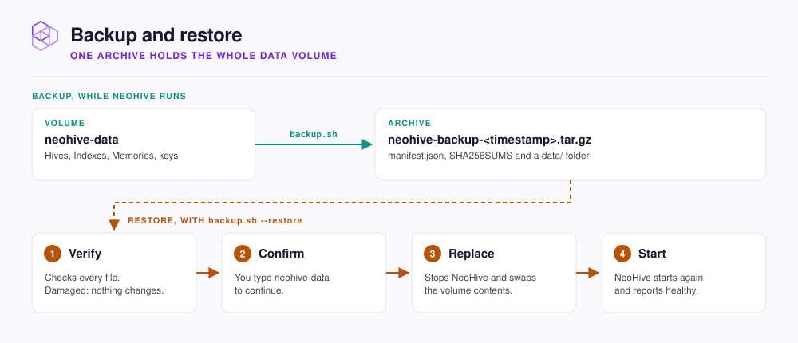

# Backups and restore

Take a backup of a running NeoHive in one command, and restore it when you need to.

Everything NeoHive stores lives in the `neohive-data` Docker volume. That includes every [Hive, Index, and Memory](../concepts/glossary.md). The `backup.sh` script copies the whole volume into one archive while NeoHive keeps running.

<figure><figcaption></figcaption></figure>

| In the archive | Not in the archive |
|---|---|
| Every database: [Hives](../concepts/glossary.md#hive), [Indexes](../concepts/glossary.md#index), [Memories](../concepts/glossary.md#memory), connections, and sync history | The cached license key in `~/.cache/neohive` |
| The search data of every Index, plus the local copies of your synced repositories | The license-seat file `machine-id` |
| The keys that encrypt your saved GitHub and GitLab credentials | Apple Silicon models in `~/.neohive/models` |


A backup holds your Memories, your indexed code, and the keys to your saved credentials. Store it like other private data, and never commit it to a repository.


## Take a backup

Before you start, make sure that the NeoHive container is running. To take a backup, run the following command on the machine where NeoHive runs:

```bash
curl -fsSL https://raw.githubusercontent.com/NeoHiveAI/install/main/backup.sh | bash
```

The script writes `neohive-backup-<timestamp>.tar.gz` to the current folder. To write the archive to a different folder, pass a folder that exists:

```bash
curl -fsSL https://raw.githubusercontent.com/NeoHiveAI/install/main/backup.sh \
  | bash -s -- --out /path/to/backups
```


**Check:** the script ends with **Backup complete.** and the archive's path.


## Restore from a backup


Restoring replaces everything in the `neohive-data` volume. You permanently lose anything added since the backup.


The NeoHive container must exist, but it can be running or stopped. To restore from a backup, run the following command with the name of your archive:

```bash
curl -fsSL https://raw.githubusercontent.com/NeoHiveAI/install/main/backup.sh \
  | bash -s -- --restore neohive-backup-<timestamp>.tar.gz
```

When the script asks you to confirm, type `neohive-data`. The `--yes` flag skips that question. Use `--yes` only in scripts.


**Check:** the script ends with **Restore complete.** When you open `http://localhost:3577`, your Hives are back.


## Move to a new machine

To move NeoHive to a new machine, do the following:

1. Install NeoHive on the new machine, so that the container exists. Follow [Install NeoHive](../get-started/install.md).
2. Copy the backup archive to the new machine.
3. On the new machine, run the command in [Restore from a backup](#restore-from-a-backup).

The restore reuses the Docker image that the new install runs, so the restore downloads nothing. When the restore finishes, your Hives are on the new machine.

<details>

<summary>Optional: non-default container, volume, or port, and Colima or Lima</summary>

The script reads the following variables. Set them if your install does not use the defaults.

| Variable | Default |
|---|---|
| `NEOHIVE_CONTAINER_NAME` | `neohive` |
| `NEOHIVE_VOLUME_NAME` | `neohive-data` |
| `NEOHIVE_PORT` | `3577` |

On Colima or Lima, a restore can stop because the container cannot see the extracted files. Your data is untouched. Set `TMPDIR` to a folder under your home directory, as the error message shows, and run the restore again.

</details>

## Next step

Continue to [Update NeoHive](updating.md). Take a backup before any update.
