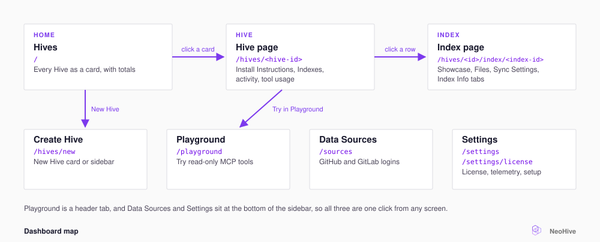

# Dashboard tour

This page explains where each screen of the dashboard is and what you do there. You use the dashboard to manage your [Hives](../concepts/glossary.md#hive) and [Indexes](../concepts/glossary.md#index). A Hive is the workspace your agent connects to, and an Index is one store of searchable context inside a Hive. For more terms, see the [NeoHive glossary](../concepts/glossary.md).

The dashboard runs at `http://localhost:3577`.

<figure><figcaption></figcaption></figure>

Two screens appear only while you set up NeoHive. **Welcome** at `/welcome` shows until you create your first Hive. The setup wizard is at `/setup`. To run the wizard again, select **Run setup wizard** in **Settings**.

## The home screen

**Hives** shows every Hive as a card, with **Total Memories**, **Added via MCP**, and **Queries (30d)** along the top. To add a 30-day line under each total, turn on **Trends**.

On the home screen, you can do the following:

- **Pin** up to two Hives to keep them in a **Pinned** row at the top.
- **Drag** the other cards to reorder them.
- **Open a card's menu** to find **Edit**, **Pin**, **Copy MCP command**, **Stop**, **Start** or **Restart**, **Archive**, and **Delete**.

## The Hive page

**Install Instructions** at the top gives ready-made commands for Claude Code, Claude Desktop, Codex, and Cursor. The section collapses after an agent connects. To open it again, select **Reinstall**.

| Section | What it shows |
|---|---|
| **AT A GLANCE** | **Memories**, **Learnings 7d**, **Queries 7d**, **Last activity** |
| Activity | **Recent learnings**, **Recent queries**, **All activity** |
| **Indexes** | Every Index in the Hive, including **Shared Indexes** from other Hives. **+** adds an Index. Each row's menu holds the actions for that Index |
| **Tool usage** | Requests per kind of agent, such as Claude Code or Cursor |
| **Sync Queue** | Syncs running or waiting |

The **An Index stopped syncing** banner at the top of the page names any Index whose sync failed and gives the reason.

## The Index page

The top of the page shows **Memories**, **Files**, **Last sync**, and **On disk**. A GitHub or GitLab Index also shows **Trigger sync**.

| Tab | Shown for | What's there |
|---|---|---|
| **Showcase** | Every Index | A preview of what the Index holds |
| **Files** | [Files Indexes](../concepts/glossary.md#files-index) | Uploaded files and a drop zone for more |
| **Sync Settings** | [Code](../concepts/glossary.md#code-index) and [Documentation Indexes](../concepts/glossary.md#documentation-index) | **Sync history**, then connection, branch, **Sync interval**, file filters, and **Pause syncing** |
| **Index Info** | Every Index | Name, description, embedding model, **Share Index…**, **Move Index…**, **Danger zone** |

An embedding model is the program that turns text into numbers for search. When an Index gets a new embedding model, NeoHive processes every [Memory](../concepts/glossary.md#memory) in the Index again with the new model. This work runs in the background, and a banner shows its progress.

## The Settings screen

| Card | What you do there |
|---|---|
| **Default Index Type** | Select **Knowledge Base** or **Code Repository** as the default for new Indexes. You can still choose a different type for each Index |
| **Server Status** | See whether your browser can reach NeoHive. To check again, select **Retry** |
| **Setup Wizard** | **Run setup wizard** takes you through setup again. The wizard does not reset or delete anything |
| **Licence Key** | **Manage licence** opens your license status. For details, see [Licensing](licensing.md) |
| **Design Partner Licence Agreement** | **View licence** shows the agreement you accepted on first run |
| **Anonymous Telemetry** | Turn off sharing of anonymized performance data. NeoHive never sends your prompts, code, or Memories |

## Keyboard shortcuts

| Keys | Action |
|---|---|
| `Cmd+K` or `Ctrl+K`, or `/` | Search palette: jump to a Hive, a connection, **Data Sources**, or **Settings** |
| `G` then `D` | Home screen |
| `G` then `S` | **Settings** |
| `Cmd+B` or `Ctrl+B` | Show or hide the sidebar |
| `?` | All shortcuts |
