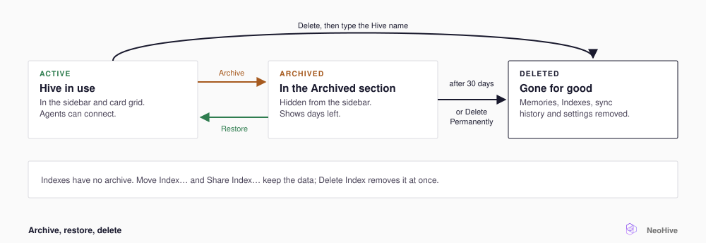

# Manage Hives and Indexes

This page explains which action to use on a [Hive](../concepts/glossary.md#hive) or an [Index](../concepts/glossary.md#index), where to find the action, and whether you can undo it. A Hive is the workspace your agent connects to, and an Index is one store of searchable context inside a Hive. For more terms, see the [NeoHive glossary](../concepts/glossary.md).

| Action | Applies to | Where | Undo |
|---|---|---|---|
| **Archive** | Hive | Hive card menu, or the menu next to its name in the sidebar | **Restore**, within 30 days |
| **Delete** | Hive | Same menu | None |
| **Move Index…** | Index | Index row menu on the Hive page, or the **Index Info** tab | Move it back |
| **Share Index…** | Index | Same places | **Revoke** |
| **Shared Index** | Another Hive's Index | **+** on the **Indexes** list | **Remove from Hive…** |
| **Delete Index** | Index | **Index Info** tab, under **Danger zone** | None |

## Archive, restore, or delete a Hive

<figure><figcaption></figcaption></figure>

**Archive** moves the Hive to the **Archived** section at the bottom of the home screen. That section shows how many days are left before NeoHive deletes the Hive. To bring the Hive back with its Indexes and [Memories](../concepts/glossary.md#memory), do the following:

1. Expand **Archived**.
2. On the Hive, select **Restore**.

The Hive returns to the home screen.


Deleting a Hive removes every Memory, Index, sync history, and setting in the Hive. You cannot undo the deletion.


To delete an active Hive, do the following:

1. In the Hive card menu, select **Delete**.
2. Type the Hive's name.
3. Select **Delete permanently**.

NeoHive removes every Memory, Index, sync history, and setting in the Hive.

To delete an archived Hive, do the following:

1. Expand **Archived**.
2. On the Hive, select **Delete Permanently**.
3. Select **Confirm**.

## Move an Index to another Hive

To move an Index, do the following:

1. In the Index row menu on the Hive page, or on the **Index Info** tab, select **Move Index…**.
2. Under **Move to**, select a Hive. Only running Hives appear in the list.
3. Select **Move Index**.

Both Hives pause briefly while the data moves, and then they resume on their own.

## Share an Index between Hives

A [Shared Index](../concepts/glossary.md#shared-index) is one Index that several Hives search, so NeoHive indexes a repository only once. You can set up a Shared Index from either Hive.


A Shared Index is one Index, not a copy. A change made from any Hive affects every Hive that uses the Index. For what each Hive can change, see [Shared Index](../concepts/hives-indexes-memories.md#shared-index).


To offer an Index from the Hive that owns it, do the following:

1. On the owning Hive, select **Share Index…**.
2. Under **Add a Hive**, select a Hive.
3. Select **Share**.

To add another Hive's Index to your Hive, do the following:

1. On your Hive page, next to **Indexes**, select **+**.
2. Select **Shared Index**.
3. Select an Index. The list shows only active Indexes that your Hive does not already use.
4. Select **Add shared Index**.

The owning Hive does not have to approve.

The borrowing Hive sees a **Shared** badge on the row. To open the owning Hive, select **Owner Hive** in the row menu, or select **Open in** on the **Index Info** tab.

To end a share, the owner selects **Revoke** in **Share Index…**, or the borrower selects **Remove from Hive…**. Neither action deletes anything.

## Delete an Index


**Delete repository** and **Delete Index** both delete Memories, and you cannot undo either action.


On the **Sync Settings** tab of a [Code](../concepts/glossary.md#code-index) or [Documentation Index](../concepts/glossary.md#documentation-index), **Delete repository** stops syncing and deletes the Index's Memories. The empty Index stays. **Delete Index** removes the Index itself.

## The Knowledge Index stays with its Hive

Every Hive has one [Knowledge Index](../concepts/glossary.md#knowledge-index), where your agent's Memories live. You cannot move, share, rename, or delete the Knowledge Index on its own. The Knowledge Index goes wherever its Hive goes, including into the archive.
