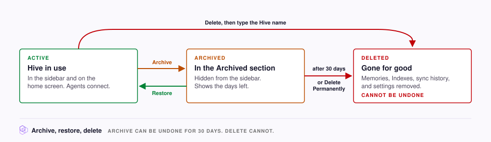

# Manage Hives and Indexes

As your work changes, you tidy up your [Hives](../concepts/glossary.md#hive) and [Indexes](../concepts/glossary.md#index): you rename or retire a Hive, move an Index to another Hive, or let two Hives search one Index. You can undo some of these actions but not others, so check the following tables before you act.

For more terms, see the [NeoHive glossary](../concepts/glossary.md).

You find the following actions in the three-dot menu (⋮) on the Hive's card on the home screen, or in the three-dot menu (⋯) next to the Hive's name in the sidebar. These actions apply to a whole Hive:

| Action | What it does | Can you undo it? |
|---|---|---|
| **Edit** | Renames the Hive or changes its icon | Yes. Edit the Hive again |
| **Archive** | Moves the Hive to the **Archived** section | Yes. Click **Restore** within 30 days |
| **Delete** | Permanently deletes the Hive and everything in it | No |

The following actions apply to one Index:

| Action | Where you find it | Can you undo it? |
|---|---|---|
| **Share Index** | The Index row's three-dot menu (⋮) on the Hive page, or the **Index Info** tab | Yes. Click **Revoke** |
| **Move Index** | The Index row's three-dot menu (⋮) on the Hive page, or the **Index Info** tab | Yes. Move the Index back |
| Add a Shared Index | **+** next to **Indexes** on the Hive page | Yes. Click **Remove from Hive** |
| **Delete repository** | The **Sync Settings** tab | No |
| **Delete Index** | The **Index Info** tab, under **Danger zone** | No |

## Rename a Hive

To rename a Hive or change its icon, do the following:

1. In the Hive's three-dot menu (⋮) on the home screen, or its three-dot menu (⋯) in the sidebar, click **Edit**.
2. In **Name**, enter the new name. If another Hive already uses the name, including an archived Hive, the dialog says so and you cannot save.
3. Optional: Under **Icon**, select a different icon.
4. Click **Save**.

The new name appears on the Hive's card and in the sidebar. Your agents keep working, because each Hive's [MCP](../concepts/glossary.md#mcp) endpoint uses the Hive's ID, not its name. The server name in your agent's configuration still shows the old name, which does not affect how the agent works.

## Archive or delete a Hive

You cannot archive or delete a Hive while another active Hive uses one of its Indexes, because the other Hive would lose that Index too. First, [stop sharing the Index](#stop-sharing-an-index). To keep the other Hive's access, [move the Index](#move-an-index-to-another-hive) to that Hive instead. A Hive that only uses another Hive's Index has no such limit.

<figure><figcaption></figcaption></figure>

### Archive and restore a Hive

Archive a Hive you no longer use but might want back. NeoHive keeps an archived Hive for 30 days, and then deletes it.

To archive a Hive, do the following:

1. In the Hive's three-dot menu (⋮) on the home screen, or its three-dot menu (⋯) in the sidebar, click **Archive**.
2. In the dialog, click **Archive**.

NeoHive moves the Hive to the **Archived** section at the bottom of the home screen, which shows how many days are left.

To restore an archived Hive, do the following:

1. On the home screen, expand **Archived**.
2. On the Hive, click **Restore**.

The Hive returns to the home screen with its Indexes and [Memories](../concepts/glossary.md#memory).

### Delete a Hive


Deleting a Hive removes every Memory, Index, sync history, and setting in the Hive. You cannot undo the deletion.


To delete an active Hive, do the following:

1. In the Hive's three-dot menu (⋮) on the home screen, or its three-dot menu (⋯) in the sidebar, click **Delete**.
2. Type the Hive's name.
3. Click **Delete permanently**.

To delete an archived Hive before its 30 days are up, do the following:

1. On the home screen, expand **Archived**.
2. On the Hive, click **Delete Permanently**.
3. Click **Confirm**.

## Move an Index to another Hive

To move an Index, do the following:

1. In the Index row's three-dot menu (⋮) on the Hive page, or on the **Index Info** tab, click **Move Index**.
2. Under **Move to**, select a Hive. The list shows only running Hives.
3. Click **Move Index**.

Both Hives pause briefly while the data moves, and then they resume on their own. The Index now appears on the other Hive's page.

## Share an Index between Hives

A [Shared Index](../concepts/glossary.md#shared-index) is one Index that several Hives search, so NeoHive indexes a repository only once. One Hive owns the Index, and the other Hives use it.


A Shared Index is one Index, not a copy. A change made from any Hive affects every Hive that uses the Index. For what each Hive can change, see [Shared Index](../concepts/hives-indexes-memories.md#shared-index).


You can set up a Shared Index from either Hive:

- From the Hive that owns the Index, share the Index with another Hive.
- From the Hive that wants the Index, add an Index that another Hive owns.

### Share an Index with another Hive

To share an Index from the Hive that owns it, do the following:

1. In the Index row's three-dot menu (⋮) on the Hive page, or on the **Index Info** tab, click **Share Index**.
2. Under **Add a Hive**, select the Hive that should use the Index.
3. Click **Share**.

The Hive appears under **Shared with**, and the Index appears on that Hive's page.

### Add another Hive's Index to your Hive

To add an Index that another Hive owns, do the following:

1. On your Hive page, next to **Indexes**, click **+**.
2. Click **Shared Index**.
3. Select an Index. The list shows only active Indexes that your Hive does not already use.
4. Click **Add shared Index**.

The Index appears in your Hive's **Indexes** list with a **Shared** badge. The owning Hive does not have to approve.

To open the Hive that owns the Index, click **Owner Hive** in the Index row's three-dot menu (⋮), or click **Open in** on the **Index Info** tab.

### Stop sharing an Index

Either Hive can stop sharing the Index. NeoHive deletes nothing when sharing stops: the Index and its Memories stay with the owning Hive.

| You are on | To stop sharing |
|---|---|
| The owning Hive | Open **Share Index**, and then click **Revoke** next to the Hive |
| The Hive using the Index | In the Index row's three-dot menu (⋮), click **Remove from Hive** |

## Delete an Index


Deleting an Index removes the Index, its sync settings, and all its Memories. You cannot undo the deletion.


Only the Hive that owns an Index can delete it. If other active Hives use the Index, stop sharing the Index with those Hives first. To delete an Index, do the following:

1. Open the Index.
2. Click the **Index Info** tab.
3. Under **Danger zone**, click **Delete Index**.
4. Click **Delete**.


The **Sync Settings** tab of a [Code](../concepts/glossary.md#code-index) or [Documentation Index](../concepts/glossary.md#documentation-index) also has a **Delete repository** button. **Delete repository** stops syncing and permanently deletes the Index's Memories, but keeps the empty Index.


## The Knowledge Index stays with its Hive

Every Hive has one [Knowledge Index](../concepts/glossary.md#knowledge-index), where your agent's Memories live. You cannot move, share, rename, or delete the Knowledge Index on its own. The Knowledge Index goes wherever its Hive goes, including into the archive.
