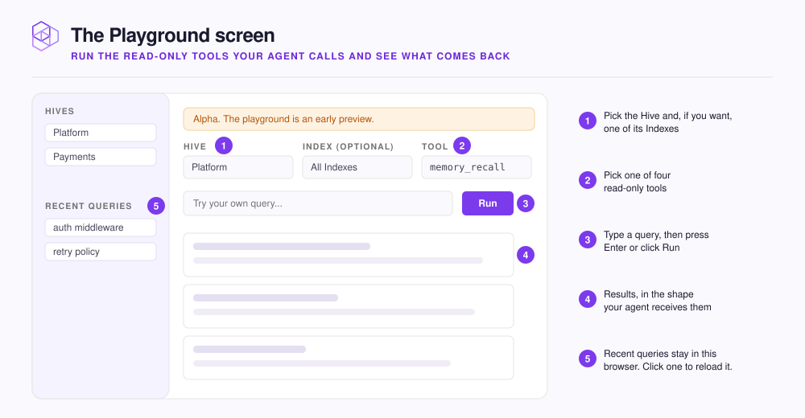

# Test queries in the Playground

The Playground is a dashboard screen where you run the same read-only tools that your agent calls. You see exactly what each tool returns. You run each tool against a [Hive](../concepts/glossary.md#hive), the workspace your agent connects to. A Hive holds [Indexes](../concepts/glossary.md#index), which are stores of searchable context. For more terms, see the [NeoHive glossary](../concepts/glossary.md).

Open **Playground** in the header bar. To open the Playground with a Hive already selected, select **Try in Playground** on that Hive's page. The screen is marked **Alpha**, which means it is an early preview.

<figure><figcaption></figcaption></figure>

| Tool | Needs a query | What it returns |
|---|---|---|
| `memory_recall` | Yes | The [Memories](../concepts/glossary.md#memory) and indexed content that best match |
| `memory_context` | Yes | **DIRECTIVES**, **CONVENTIONS**, and **TASK RELEVANT**, which an agent loads at the start of a task |
| `list_indexes` | No | Every Index the Hive can search |
| `memory_stats` | No | **Total memories**, **Top types**, **Recent growth** |

Nothing you run in the Playground adds, changes, or deletes a Memory. Running `list_indexes` is also a quick way to test a Hive before you connect any agent.

## Run a query



## Select the scope

Select a **Hive**. To search the whole Hive as your agent does, leave **Index (optional)** set to **All Indexes (cross-index fan-out)**. To search one Index, select that Index. The list includes [Shared Indexes](../concepts/glossary.md#shared-index).



## Select the tool

Select a **Tool**. `memory_recall` is the default.



## Run the tool

For `memory_recall` or `memory_context`, type your query into **Try your own query...**, and then press `Enter` or select **Run**. For the other two tools, select **Run**.




**Check:** Run `memory_recall` with a query about something that you know is in the Hive. That content appears near the top of the results. If you get **No memories matched this query.**, see [Recall isn't finding what I need](../troubleshooting/recall.md).


## Use the Playground to tune your prompts

Try one question phrased two or three ways and compare the results. The Playground runs the same search that your agent runs, so phrasing that works in the Playground also works for your agent.

Some content might be missing, or it might only rank below results from another Index. To find out which is true, narrow the search to one Index. If that Index returns the content and **All Indexes** does not, the content is in the Index but ranks below other results.

## What the Playground does not change

Playground runs do not count toward the query totals on the home screen or the Hive page.

The Playground saves each run under **Recent queries** in the sidebar. To load a run again, select it. To empty the list, select **Clear**. Your browser stores the list, so teammates do not see it.

<details>

<summary>Optional: link directly to a prepared query</summary>

The Playground reads its settings from the URL, so a link can open the Playground with every field filled in:

```text
http://localhost:3577/playground?hive=<hive-id>&tool=memory_recall&query=auth%20middleware
```

To narrow the query to one Index, add `index=<index-id>`.

</details>
