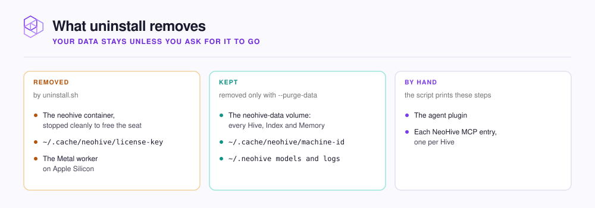

# Uninstall

When you no longer want NeoHive on this machine, the uninstall script removes what the installer put there. You decide whether your data goes too. Your data is every [Hive](../concepts/glossary.md#hive), [Index](../concepts/glossary.md#index), and [Memory](../concepts/glossary.md#memory) on this machine, and the script keeps it unless you pass `--purge-data`. After the script runs, you disconnect your agents by hand.

The uninstall script lists what it found and asks you to confirm once.

<figure><figcaption></figcaption></figure>


Do not use `docker rm -f neohive` as a shortcut. That command stops the container without a clean shutdown. The license seat then stays in use until the licensing service notices that the machine has stopped checking in.


To uninstall NeoHive, follow these steps.



## Preview the plan

To see what the script would remove without changing anything, run the script with `--dry-run`:

```bash
curl -fsSL https://raw.githubusercontent.com/NeoHiveAI/install/main/uninstall.sh \
  | bash -s -- --dry-run
```



## Remove NeoHive



```bash
curl -fsSL https://raw.githubusercontent.com/NeoHiveAI/install/main/uninstall.sh | bash
```

If you install NeoHive again later, the new install finds your Hives as you left them.




Deleting the volume permanently removes every Hive, Index, and Memory. You can get them back only from a backup. See [Backups and restore](backups.md).


```bash
curl -fsSL https://raw.githubusercontent.com/NeoHiveAI/install/main/uninstall.sh \
  | bash -s -- --purge-data
```

The `--purge-data` option also deletes the data volume, `~/.neohive`, and all of `~/.cache/neohive`. If NeoHive is running, the script offers a backup first. Then the script asks you to type the volume name before it deletes anything. If the name you type does not match, the script still removes NeoHive but keeps the data volume, `~/.neohive`, and `~/.cache/neohive/machine-id`.



The `--yes` flag skips the questions. Use `--yes` only in scripts. With `--purge-data`, `--yes` also skips the backup offer and the typed volume name. The script then deletes the volume without asking.



## Remove the agent plugin

The script cannot reach your editors, so the script ends by printing the Claude Code steps. To remove the plugin, run the following command in a Claude Code session:

```text
/plugin uninstall neohive@neohive-claude
```

For Cursor, delete the `~/.cursor/plugins/local/neohive` link. For Codex, delete the `NeoHiveCodex` folder you cloned.



## Remove the MCP entries

Removing the plugin can leave the [MCP](../concepts/glossary.md#mcp) entries behind. There is one NeoHive entry for each Hive. To remove the entries in Claude Code, run `claude mcp list` to list them. Then run `claude mcp remove` for each NeoHive entry:

```bash
claude mcp list
claude mcp remove <neohive-entry>
```

For other agents, delete the NeoHive entries from the agent's MCP config file. The following table lists the file for each agent.

| Agent | MCP config file |
|---|---|
| Cursor | `.cursor/mcp.json` in your project, or `~/.cursor/mcp.json` |
| Codex | `~/.codex/config.toml` |
| Claude Desktop | `claude_desktop_config.json` |




**Check:** To confirm that NeoHive is gone, run the following command:

```bash
docker ps -a --filter name=neohive
```

The list is empty, and `claude mcp list` shows no NeoHive entries.

