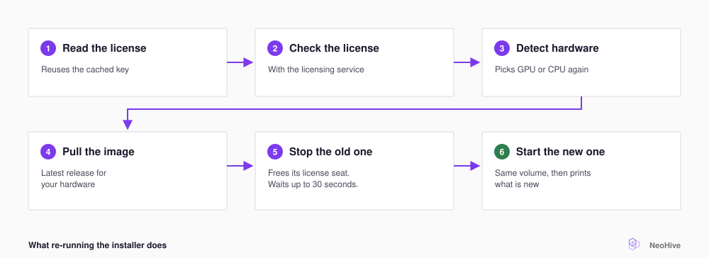

# Update NeoHive

An update replaces the NeoHive container with a new one that runs the latest release. Your data does not live inside the container: NeoHive keeps it in the `neohive-data` Docker volume, and the new container starts on that same volume. Your [Hives](../concepts/glossary.md#hive), [Indexes](../concepts/glossary.md#index), and [Memories](../concepts/glossary.md#memory) stay in place.

To update, run the same installer command that you used to install NeoHive. The dashboard tells you when a new release is out, but the dashboard does not install the release for you. Take a backup first, and set again any installer settings you changed, because the installer does not remember them.

<figure><figcaption></figcaption></figure>

## Know when an update is out

The bell icon in the dashboard opens the **NeoHive updates** panel. When a new release is available, the panel shows your version and the new version. The panel also shows release highlights and **View full changelog**. A dot also appears on the NeoHive logo in the sidebar.

The dashboard checks for updates automatically. To check right away, select the refresh button in the panel. The panel tells you about an update, but the panel never installs one.

## Run the update


If a repository sync is still running when the old container stops, the sync stops before it finishes. The sync runs again at its next scheduled time. To run the sync sooner, open the Index and select **Trigger sync**.




## Take a backup

A backup copies everything NeoHive stores into one archive. If the update fails, you can restore your data from that archive. Follow the steps in [Backups and restore](backups.md).



## Re-run the installer

```bash
bash <(curl -fsSL https://raw.githubusercontent.com/NeoHiveAI/install/main/install.sh)
```

The installer reuses your cached license key. To use a different license, see [Replace your license](licensing.md#replace-your-license). On Apple Silicon, the installer also updates the [Metal worker](../concepts/glossary.md#metal-worker) and keeps downloaded models. The Metal worker is the program that turns text into numbers for search on the Mac's GPU.



## Repeat the settings you installed with

The installer does not remember options from the last install. If you leave out a variable, the installer uses its default value. For example, NeoHive returns to port `3577`, so agents that use your old port cannot connect. When you update, set again any of the following variables that you used:

| Variable | Why you set it |
|---|---|
| `NEOHIVE_PORT` | NeoHive runs on a port other than `3577` |
| `NEOHIVE_BACKEND` | You forced a backend. See [GPU and CPU](gpu-cpu.md) |
| `NEOHIVE_METAL_WORKER`, `NEOHIVE_METAL_WORKER_PORT` | You turned off or moved the Metal worker |
| `NEOHIVE_PDF_BRIDGE_TIMEOUT_MS`, `NEOHIVE_PDF_WARMUP_TIMEOUT_MS`, `NEOHIVE_CHUNKER_TIMEOUT_MS` | You gave large files more time |

For example, the following command sets a different port and forces the CPU backend:

```bash
NEOHIVE_PORT=4000 \
NEOHIVE_BACKEND=cpu \
  bash <(curl -fsSL https://raw.githubusercontent.com/NeoHiveAI/install/main/install.sh)
```

For the full list of variables, see [Environment variables](../reference/environment-variables.md).


**Check:** To confirm that NeoHive is running again, run the following command:

```bash
curl http://localhost:3577/health
```

The reply contains `"status":"ok"`. The version at the bottom of the sidebar shows the new release.

