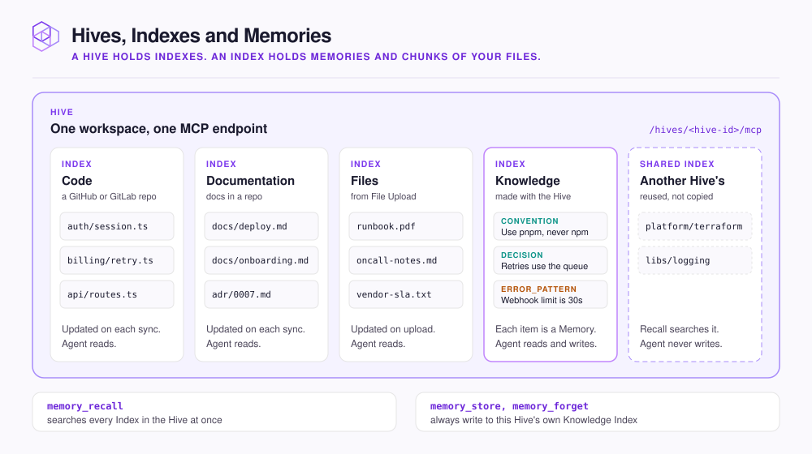

# Hives, Indexes, and Memories

NeoHive organizes everything your agent can recall in three levels. A Hive is a workspace for one team or codebase. Each Hive holds Indexes, and each Index stores one kind of content, such as your code. A Memory is one lesson that your agent stores, such as a convention.

The three levels decide what your agent searches and where the agent saves what it learns. Knowing the levels helps you decide where to put new content.

This page explains each level and what a Memory contains. It also shows how one Hive can use an Index that another Hive owns.

<figure><figcaption></figcaption></figure>

## Hives

A Hive is a workspace. A Hive keeps the context for one codebase or team separate from unrelated work. You create Hives in the dashboard at `http://localhost:3577`. Each Hive has one [MCP](glossary.md#mcp) endpoint, `/hives/<hive-id>/mcp`. Every agent connected to the Hive sees the same context.

Put closely related code, such as the services in one monorepo, in one Hive. Keep unrelated codebases in separate Hives.

## Indexes

An Index holds one kind of context inside a Hive. Each Index has its own storage and its own embedding model. An embedding model turns text into embeddings, which are lists of numbers that capture what the text means.

| Index | Filled from | Who writes to it |
|---|---|---|
| **Code** | A GitHub or GitLab repository | NeoHive, on every sync |
| **Documentation** | Docs in a GitHub or GitLab repository | NeoHive, on every sync |
| **Files** | `.md`, `.markdown`, `.txt`, and `.pdf` files you add with **File Upload** | NeoHive, on upload |
| **Knowledge** | What your agents learn as you work | Your agents, through `memory_store` |

Every Hive gets one Knowledge Index when you create it. You cannot add a second one.

Your agent does not need to choose an Index. One `memory_recall` call searches every Index in the Hive and returns code, docs, and Memories together.

## Shared Index

A **Shared Index** is a Code, Documentation, or Files Index that another Hive owns. NeoHive adds the Shared Index to your Hive without copying the Index or indexing its files again. Recall searches the Shared Index, but your agents never write to it. `memory_store` and `memory_forget` always write to your own Knowledge Index.

You can share an Index from the Hive that owns it, or add another Hive's Index from your own Hive. For the steps, see [Share an Index between Hives](../admin/manage.md#share-an-index-between-hives).

In the dashboard, a Hive that uses a Shared Index can do almost everything that the owning Hive can do:

| Action | Owning Hive | Hive using the Index |
|---|---|---|
| Sync the Index, or change its connection, branch, filters, and embedding model | Yes | Yes |
| Delete repositories or files from the Index | Yes | Yes |
| Delete the Index | Yes, after every other Hive stops using it | No |
| Share the Index further, or move it | Yes | No |
| Stop using the Index (**Remove from Hive**) | Not applicable | Yes |


Both Hives use the same Index, not a copy. Every change made from either Hive applies to both Hives. You cannot share a Knowledge Index.


## Memories

A Memory is one stored piece of knowledge in a Knowledge Index. Examples are a convention, a decision, a correction, or a problem to watch out for. Your agent stores a Memory when you ask it to remember something. Your agent also stores a Memory when it finds something worth keeping.

| A Memory has | What it is |
|---|---|
| A type | A label such as `directive`, `convention`, `decision`, or `error_pattern`. Your agent chooses the type. See [Memory types](../reference/memory-types.md) |
| Tags | Words that help later searches find the Memory |
| An importance | A number from 1 to 10. The default is 5. |

When a Memory is out of date, your agent calls `memory_forget`. `memory_forget` deactivates the Memory instead of deleting it. The call can also name the newer Memory that replaces the old one.

Code, Documentation, and Files Indexes hold chunks instead of Memories. A chunk is a section of a file, such as a function or a heading and its text.
