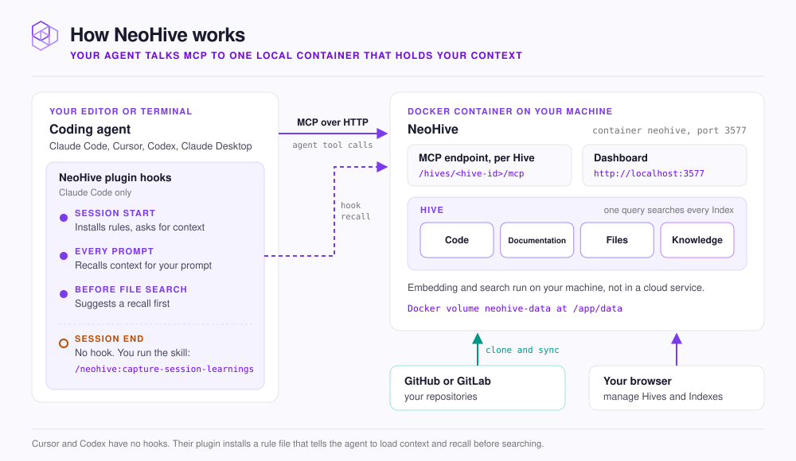

# How NeoHive works

NeoHive has three parts: your coding agent, the NeoHive plugin that tells the agent when to use memory, and the NeoHive container that stores and searches your context. Each part runs in a different place. Knowing where each one runs and how the parts connect helps you set NeoHive up, and helps you find the cause when an agent cannot reach it.

<figure><figcaption></figcaption></figure>

NeoHive is one Docker container named `neohive`, on your machine or a shared server. The container serves the dashboard at `http://localhost:3577`. The container also serves one [MCP](glossary.md#mcp) endpoint for each [Hive](glossary.md#hive) at `/hives/<hive-id>/mcp`. A Hive is a workspace for one codebase or team. Each Hive holds several [Indexes](glossary.md#index), and each Index stores one kind of context, such as your code. Your data lives in the `neohive-data` Docker volume, mounted at `/app/data`.

## The three parts

| Part | Where it runs | What it does |
|---|---|---|
| Your agent | Your editor or terminal | Calls NeoHive tools such as `memory_recall` and `memory_store` over MCP. |
| The NeoHive plugin | Inside Claude Code, Cursor, or Codex | Adds rules that tell the agent when to use memory. In Claude Code, the plugin also adds hooks. Hooks are scripts that run at fixed points in a session. |
| The NeoHive container | Docker, on your machine or a shared server | Stores your Hives and Indexes, finds context for each question, and syncs repositories |

Your agent never reads NeoHive's files. Your agent asks for context through an MCP tool, and the container replies with matching code, docs, and [Memories](glossary.md#memory).

Claude Desktop and other MCP apps have no plugin. They connect to the same MCP endpoint and call the same tools.

## Hooks in Claude Code

When you send a prompt, a hook sends the prompt directly to `memory_recall` in the container. The hook then adds the results to the agent's context before the agent starts its answer. No hook runs when a session ends. To save what your agent learned in a session, run `/neohive:capture-session-learnings`.

Cursor and Codex have no hooks. Instead, the plugin for Cursor and Codex installs a [rules file](glossary.md#rules-file). The rules file tells the agent to load context at the start of a session. The rules file also tells the agent to recall context before it searches files. [What the plugin does automatically](../results/plugin-automation.md) lists every hook and the switch that turns it off.

## Repositories

When you add a repository, the container copies (clones) it from GitHub or GitLab into the `neohive-data` volume. The container splits the files into [chunks](glossary.md#chunk) and turns each chunk into an embedding, which is a list of numbers that captures what the text means. The container stores the embeddings in a [Code](glossary.md#code-index) or [Documentation Index](glossary.md#documentation-index).

On later syncs, the container indexes only the files that changed.

NeoHive embeds and searches your content on the machine it runs on. [What stays on your machine](../security/local-only.md) lists every connection the container makes to services outside your machine.
