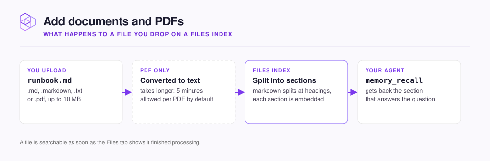

# Add documents and PDFs

Create a Files [Index](../concepts/glossary.md#index) and upload your documents to it. A Files Index stores files you upload. Your agent then recalls the documents the same way it recalls code.

<figure><figcaption></figcaption></figure>

Use a Files Index for specs, runbooks, design docs, meeting notes, or an exported notes vault. For markdown that already lives in a repository, add a Documentation Index instead. A Documentation Index stays in sync with the repository. For help choosing, see [What to add, and where](what-to-add.md).



## Create the Index

To create a Files Index, do the following:

1. Open your [Hive](../concepts/glossary.md#hive) at `http://localhost:3577`.
2. Select **+** next to **Indexes**.
3. Select **File Upload**.



## Add files

Optional: Drag files onto the **Files** drop zone, up to 20 at a time. The files upload after NeoHive creates the Index. You can also skip this step and upload files later.

NeoHive accepts `.md`, `.markdown`, `.txt`, and `.pdf` files of up to 10 MB each. For details, see [Supported file types](../reference/file-types.md).



## Name and create the Index

NeoHive fills in **Index name** from the first file. To name and create the Index, do the following:

1. Change **Index name** to describe the documents, for example `Engineering Docs`.
2. Select **Create Index**.

Each file becomes searchable as soon as it finishes processing.



To help your agent choose this Index, set a **Description** on the **Index Info** tab. Name the kind of documents the Index holds. Your agent reads this description through `list_indexes`.

## Manage files later

To manage files, open the Index and select its **Files** tab. You can drop more files on the tab at any time. The tab shows which file is processing and how much of that file is done. When you delete a file, NeoHive removes its content from the Index.

If a file has the same name as a file already in the Index, NeoHive skips the new file and shows a warning. To replace a document, delete the old file first, and then upload the new one.


To move an Obsidian vault or a similar notes vault, export it as markdown and upload the files.


## Large PDFs

By default, NeoHive allows five minutes to convert each PDF. A 900-page PDF can take 25 to 30 minutes. To raise the limit, set `NEOHIVE_PDF_BRIDGE_TIMEOUT_MS` to a value in milliseconds when you run the installer:

```bash
NEOHIVE_PDF_BRIDGE_TIMEOUT_MS=1800000 \
  bash <(curl -fsSL https://raw.githubusercontent.com/NeoHiveAI/install/main/install.sh)
```

When NeoHive converts the first PDF on a new machine, it also downloads the model that the converter uses. If that download times out, raise `NEOHIVE_PDF_WARMUP_TIMEOUT_MS` the same way. For details, see [Environment variables](../reference/environment-variables.md).

If a PDF is scanned, or draws its text as shapes, the conversion fails with `No text could be extracted from this PDF`.

## Next step

Your documents are now in a Files Index. Continue to [Capture team knowledge](team-knowledge.md) to see how your agent adds what it learns.
