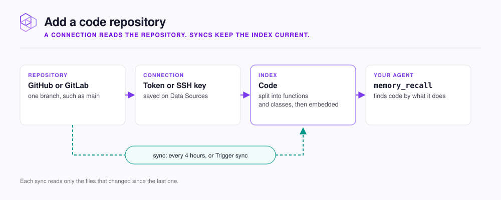

# Add a code repository

Connect a repository once, and your agent can find code by describing what the code does. NeoHive stores the code in a [Code Index](../../concepts/glossary.md#code-index), which is one store of searchable context inside your [Hive](../../concepts/glossary.md#hive). A Hive is the workspace your agent connects to. For more terms, see the [NeoHive glossary](../../concepts/glossary.md). Scheduled syncs keep the [Index](../../concepts/glossary.md#index) up to date.

<figure><figcaption></figcaption></figure>

Your agent asks `how does the sync engine handle retries?` and gets back the functions that handle retries, even when those words never appear in the file. Code results come back in the same answer as your team's [Memories](../../concepts/glossary.md#memory), such as stored conventions and decisions.

| Task | Page |
|---|---|
| Save a connection, select the repository and branch, and create the Index | [Connect GitHub or GitLab](connect.md) |
| Keep generated code, fixtures, and other unwanted files out | [Choose which files are included](file-patterns.md) |
| Set the sync schedule, sync on demand, and read the sync history | [Keep a repository up to date](sync.md) |

Before you start, you need a Hive, read access to the repository, and a personal access token (PAT) or SSH key for that repository.

NeoHive copies the code and turns it into a searchable form on the machine that runs NeoHive. NeoHive never sends the code to an outside service. For details, see [What stays on your machine](../../security/local-only.md).


The first sync reads every file. For a typical service, the first sync takes a few minutes. For a large monorepo (one repository that holds many projects), the first sync takes longer. Later syncs read only the files that changed. A GPU makes indexing faster. For details, see [GPU and CPU](../../admin/gpu-cpu.md).

