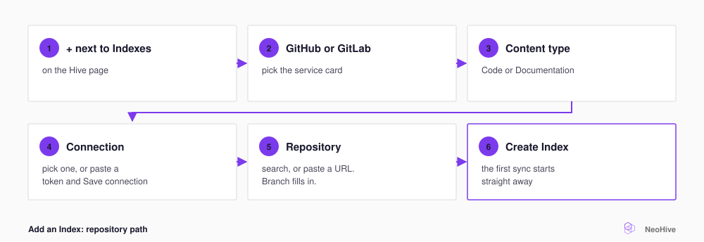

# Connect GitHub or GitLab

Create a token, save it as a connection, select the repository, and then select **Create Index**. The first sync starts automatically. An [Index](../../concepts/glossary.md#index) is one store of searchable context inside a [Hive](../../concepts/glossary.md#hive), and a Hive is the workspace your agent connects to. For more terms, see the [NeoHive glossary](../../concepts/glossary.md).

<figure><figcaption></figcaption></figure>

## Create a token

The connection form has a **Create a PAT** link. The link opens your provider's page for creating a personal access token (PAT). The page already has the token name and scopes filled in. Scopes are the permissions the token grants.



Create a classic personal access token with the `repo` scope. The token starts with `ghp_`.

```text
https://github.com/settings/tokens/new?scopes=repo&description=NeoHive
```



Create a personal access token with the `read_api` and `read_repository` scopes. The token starts with `glpat-`.

```text
https://gitlab.com/-/user_settings/personal_access_tokens?name=NeoHive&scopes=read_api,read_repository
```

If you host your own GitLab, first enter your instance's address in **GitLab Base URL**. The **Create a PAT** link then opens your own instance. If you use `gitlab.com`, leave the field blank.



In the connection form, select the **SSH** tab and paste an SSH private key into **SSH Private Key**. The key needs read access to the repository. For example, you can use a deploy key, which is a key added to a single repository.



## Create the Index

To create the Index, do the following:

1. Open your Hive at `http://localhost:3577`.
2. Next to **Indexes**, select **+**.
3. Select **GitHub** or **GitLab**.
4. Under **Content type**, select **Code**. If the Index holds only docs, select **Documentation** instead.
5. Fill in the remaining fields, as the following table describes.
6. Select **Create Index**.

NeoHive opens the new Index page, copies the repository, and starts the first sync. The page header shows the progress.

The following table describes the remaining fields:

| Field | What to do |
|---|---|
| **Connection** | Select a saved connection. If you have no saved connection, or if you select **Add a new connection**, a form opens. In the form, enter a **Name** such as `Acme GitHub`, paste the token into **Personal Access Token**, and select **Save connection**. |
| **Repository** | Select a repository from the list, or type into **Search repositories or paste a URL...**. If you paste the URL of a repository that the list does not show, the repository appears as a **Use** row, such as **Use acme/api**. |
| **Index name** | This field appears after you select a repository. NeoHive fills it in from the repository, such as `acme/api`. The name must be unique in the Hive. |
| **Branch** | This field appears after you select a repository. NeoHive fills it in with the repository's default branch. To use another branch, select it from the list. |

When you save a token, NeoHive checks it with the provider. If the provider rejects the token, NeoHive does not save it. If you already saved that token or that account, NeoHive warns you and offers **Add anyway**.


**Check:** Open the Index's **Sync Settings** tab. **Sync history** shows the first run. When the run finishes, its status reads `success`.


## After you create the Index

Open the **Index Info** tab, and then fill in **Description**. Your agent reads the description through `list_indexes`, so name what the repository covers. For example, write `Billing and payments services: Stripe webhooks, retries, nightly reconciliation` rather than `repo index`.

<details>
<summary>Optional: switch to an embedding model specialized for code</summary>

A new [Code Index](../../concepts/glossary.md#code-index) uses a general text embedding model, the model that turns content into a searchable form. The **Embedding model** setting on the **Index Info** tab also offers **Nomic Embed Code** models. These models match code more closely, but they need a lot of GPU memory. The list marks each option **Fits** or **Won't fit** for your machine. When you save a new model, NeoHive processes the whole Index again with that model in the background. For details, see [GPU and CPU](../../admin/gpu-cpu.md).

</details>

The **Data Sources** page lists your saved connections. For details, see [Data sources and credentials](../../admin/data-sources.md).
