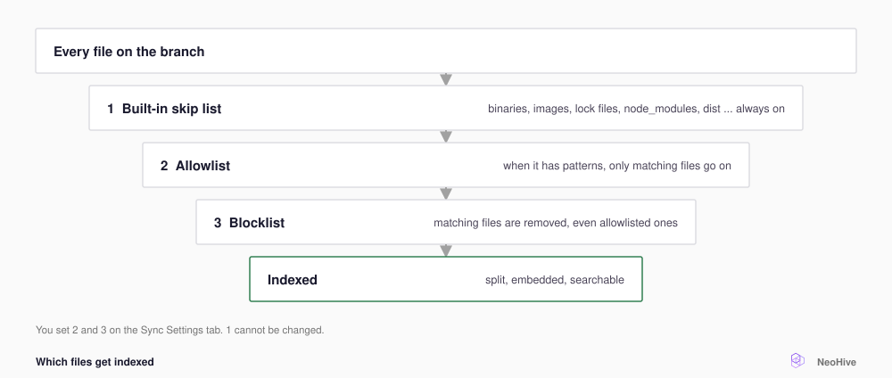

# Choose which files are included

Set an **Allowlist** and a **Blocklist** so that the [Index](../../concepts/glossary.md#index) holds the files that answer questions. Build output and test fixtures (sample data for tests) stay out. An Index is one store of searchable context inside a [Hive](../../concepts/glossary.md#hive), the workspace your agent connects to. For more terms, see the [NeoHive glossary](../../concepts/glossary.md).

<figure><figcaption></figcaption></figure>

## When to use which

| You want to | Use |
|---|---|
| Include the whole repository but leave out generated code, fixtures, or snapshots | **Blocklist** only |
| Include only one part, such as `src/**` and `docs/**` | **Allowlist** only |
| Include only one part but leave out its tests | Both |
| Limit a [Documentation Index](../../concepts/glossary.md#documentation-index) to docs | **Allowlist** with `**/*.md` |

A typical Blocklist looks like this:

```text
**/__fixtures__/**
**/*.snap
docs/generated/**
```

Write one glob pattern (a file path with wildcards) per line. Each pattern matches the file's path from the repository root. A single `*` does not match across a `/`, so write `**/*.snap` rather than `*.snap`. For wildcards, braces, and more examples, see [File pattern syntax](../../reference/file-patterns.md).

## Set the patterns


A new pattern does not remove files that the Index already holds. Set the patterns early, before the Index fills with files you do not want. For how a pattern change applies, see [How the filters combine](../../reference/file-patterns.md#how-the-filters-combine).


To set the patterns, do the following:



## Open the filters

Open the Index, and then select the **Sync Settings** tab. **File filters** is under **Configuration**.



## Enter the patterns

Type one pattern per line into **Allowlist**, **Blocklist**, or both. To get a first draft of the patterns, select **Copy AI prompt**. Paste the prompt into your agent, and then describe your repository.



## Save the settings

Select **Save settings**.



## Sync the Index

At the top of the page, select **Trigger sync**. The sync applies the new patterns.



If your agent cannot find a file, check both lists first, because a pattern might filter the file out.

## Next step

Now that the Index includes the right files, keep them up to date. Continue to [Keep a repository up to date](sync.md).
