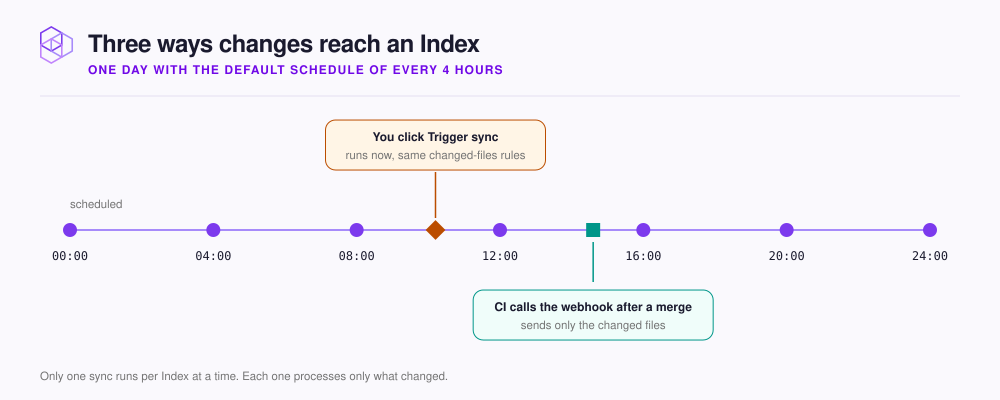

# Keep a repository up to date

Choose a sync schedule for a [Code](../../concepts/glossary.md#code-index) or [Documentation Index](../../concepts/glossary.md#documentation-index). An [Index](../../concepts/glossary.md#index) is one store of searchable context inside a [Hive](../../concepts/glossary.md#hive), the workspace your agent connects to. For more terms, see the [NeoHive glossary](../../concepts/glossary.md). To index a change right away, select **Trigger sync**. When something looks wrong, read **Sync history**.

<figure><figcaption></figcaption></figure>

Each sync reads only what changed since the last indexed commit. NeoHive indexes new, modified, and renamed files again, and removes deleted files from the Index.

## Set the schedule

To set the schedule, do the following:

1. Open the Index's **Sync Settings** tab.
2. Under **Configuration**, select a **Sync interval**.
3. Select **Save settings**.

Syncs run at fixed times of day. For example, **Every 4 hours** runs at 00:00, 04:00, 08:00, and so on, and **Daily** runs at 00:00.

| **Sync interval** | Good for |
|---|---|
| **Every 15 minutes**, **Every 30 minutes** | A busy repository where your agent needs changes quickly |
| **Every hour** | Most repositories |
| **Every 4 hours** | The default for an Index you add from the dashboard |
| **Daily** | A repository that rarely changes |

You also set the **Branch** and the **Connection** on the same card. **Pause syncing** stops scheduled syncs without deleting anything, and **Resume syncing** starts them again.

If NeoHive was not running when a sync was due, NeoHive syncs that Index as soon as NeoHive starts again.

## Sync now

To sync now, do the following:

1. At the top of the Index page, select **Trigger sync**. A **Sync Warning** says that the sync can slow down the machine.
2. Optional: To skip the warning next time, select **Don't show this again**.
3. Select **I Understand**.

The page header shows the sync progress and a button to cancel the sync.

When some files fail, NeoHive tries them again automatically a little later. If a file keeps failing, NeoHive stops retrying it until you select **Trigger sync**. **Trigger sync** gives the file one more try.

To index changes right after every merge, your CI pipeline can send the changed files to the webhook refresh endpoint. The webhook works differently from a sync, as [How the webhook differs from a sync](../../reference/webhooks.md#how-the-webhook-differs-from-a-sync) explains.

## Read the sync history

**Sync history** appears at the top of the **Sync Settings** tab and lists the newest run first.

| Column | Tells you |
|---|---|
| **Time**, **Duration** | When the run started and how long it took |
| **Status** | `running`, `success`, `failed`, or `cancelled`. `partial`, shown in amber, means that some files failed |
| **Files** | Files added, modified, deleted, and renamed, such as `+12A / ~3M` |
| **Progress**, **Chunks** | Files done out of the total, and pieces added or removed |
| **Commit Range** | The commits between the previous run and this one |
| **Error** | What went wrong. Select the error to read the full message |

If someone renames the branch, for example from `master` to `main`, the sync follows the new name when the match is clear. Otherwise, the page shows **Branch not found on the remote**. In that case, select the correct branch under **Sync a different branch**. For runs that keep failing, see [Repository sync issues](../../troubleshooting/sync.md).
