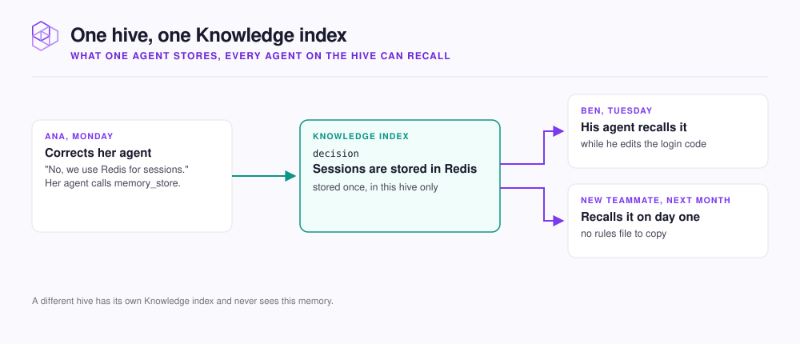

# Capture team knowledge

Every [Hive](../concepts/glossary.md#hive) (your team's NeoHive workspace) has a Knowledge [Index](../concepts/glossary.md#index). When one person's agent stores a [Memory](../concepts/glossary.md#memory) in the [Knowledge Index](../concepts/glossary.md#knowledge-index), every agent connected to the Hive can recall that Memory.

<figure><figcaption></figcaption></figure>

The Knowledge Index holds what your team has learned: conventions, decisions and their reasons, problems to watch for, and corrections. NeoHive creates the Knowledge Index with the Hive. The Hive page lists the Knowledge Index under **Indexes**. Your agents write to the Knowledge Index, so you have nothing to set up. You cannot change the Knowledge Index's settings, share it with another Hive, or move it to another Hive.

## How knowledge gets in

| Way in | What happens |
|---|---|
| You ask | Say `Remember that the payments API requires idempotency keys on all POST requests.` Your agent calls `memory_store`. |
| Your agent notices | When you correct your agent or agree on a convention, the agent stores the point on its own. |
| End of session | Run `/neohive:capture-session-learnings` in Claude Code, or the `capture-session-learnings` skill in Cursor or Codex. The skill stores up to five learnings from the conversation. |
| Existing rules files | Import `CLAUDE.md`, `AGENTS.md`, and rules folders once. See [Migrate from CLAUDE.md](migrate.md). |

`memory_store` always writes to the Knowledge Index of the Hive your agent is connected to. Your agent gives each Memory a type, such as `directive`, `convention`, or `decision`. [Memory types](../reference/memory-types.md) lists them all.

## Who can recall your team's Memories

Everyone who connects an agent to the same Hive shares one Knowledge Index. A teammate who joins later starts with everything the team has stored. Agents connected to a different Hive never see this Knowledge Index. Two Hives that use the same [Shared Index](../concepts/glossary.md#shared-index) (an Index that several Hives use) still keep separate Knowledge Indexes.

For this reason, [What to add, and where](what-to-add.md) suggests one Hive per product. To control who can reach a Hive, see [Access and sharing](../admin/access.md).

To see what your team's agents stored recently, check **Recent learnings** on the Hive page. To open the Knowledge Index, select **Knowledge** under **Indexes**.

## Correct what goes stale

When a Memory is out of date, tell your agent. Your agent stores the new fact and switches off the old Memory. For what to say, see [Say "out of date" when a fact changes](../results/teach.md#say-out-of-date-when-a-fact-changes).

Write each Memory so that a reader with no background can understand it. Name the service, the rule, and the reason. For more on phrasing, see [Teach your agent as you work](../results/teach.md).

## Next step

If you already have rules in `CLAUDE.md` or `AGENTS.md`, continue to [Migrate from CLAUDE.md](migrate.md).
