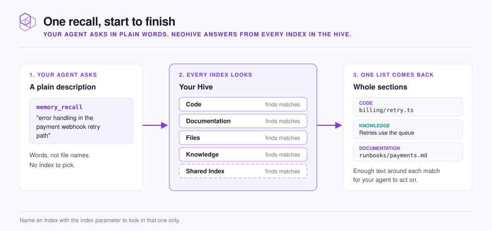

# How retrieval works

This page explains what one recall does for your agent, and how you can influence the results.

<figure><figcaption></figcaption></figure>

Your agent does not search for file names or read files from top to bottom. Instead, your agent describes what it needs. NeoHive then finds context that matches the meaning of that description. An exact function name or error code in the query still finds the text that contains it.

When a small part of a file matches, NeoHive returns the whole section that contains it. Your agent then has enough text to act on. NeoHive returns results from every [Index](../reference/glossary.md#index) in your [Hive](../reference/glossary.md#hive) together in one ranked list. Results from an Index with strong matches rank above results from an Index with weak matches.

Memories also rank by how your team uses them. Each time recall returns a Memory, that Memory ranks a little higher next time. A Memory that nobody recalls for a while slowly ranks lower. NeoHive does not delete it, so the Memory still comes back when a query matches it closely. A Memory's importance, from `1` to `10`, also raises its rank.

## Two ways to ask

| Tool             | Use it for                                                                                                                                                                                                                |
| ---------------- | ------------------------------------------------------------------------------------------------------------------------------------------------------------------------------------------------------------------------- |
| `memory_context` | The start of a task. `memory_context` returns the directives and conventions that match the task you describe. It also returns other [Memories](../reference/glossary.md#memory) and indexed content that match the task. |
| `memory_recall`  | A specific question in the middle of a task                                                                                                                                                                               |

Both tools search every Index in the Hive unless you name one Index.

## What you control

NeoHive sets the order of results automatically. You control recall through what you ask and which Index you ask.

These parameters of `memory_recall` change what recall returns:

* To find more of what you need, pass up to five phrasings of the same need in `queries`. Different phrasings match different text.
* To search one Index only, set `index`. The search is faster and more focused when you know which Index holds the answer.
* To get only certain kinds of result, list them in `types`, such as `directive` and `convention`. NeoHive also sets a type on each section of code and docs, so those sections can match too.

[MCP tools](../reference/mcp-tools.md) lists every `memory_recall` parameter, with its default and limits.

Search the whole Hive first to see which Index answers best. Then repeat the query with `index` set to that Index.

The phrasing of a query matters. `GitHub Actions concurrency limit workaround` finds more than `how do I fix GitHub Actions`. [Write prompts that retrieve well](../get-better-results/prompting.md) covers phrasing in more detail.


How NeoHive orders results is internal and can change between releases. Do not write rules or prompts that depend on a particular order. The way you phrase the query is the part you can rely on.


## Next step

Put context into your Hive. Start with [What to add, and where](../add-your-context/what-to-add.md).
