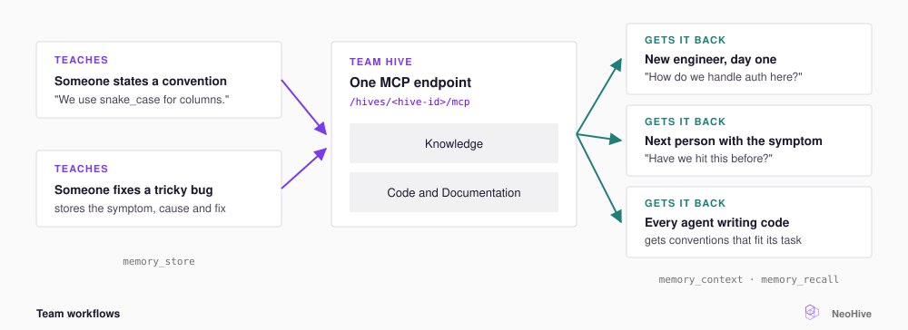

# Team workflows

A [Hive](../reference/glossary.md#hive) is a workspace in NeoHive that holds your [Indexes](../reference/glossary.md#index) and [Memories](../reference/glossary.md#memory). When every agent on the team connects to the same Hive, everything one person teaches reaches the whole team.

Without a shared Hive, each person teaches their own agent the same things. One teammate explains a convention, and the next teammate explains it again. A shared Hive stores the lesson once, as a Memory. Every teammate's agent can then recall that Memory, whichever tool the teammate uses.

This page shows how to connect each teammate to the team's Hive. The page then shows three ways teams use that Hive: onboarding, debugging with past fixes, and keeping conventions consistent.

<figure><figcaption></figcaption></figure>

## Connect each person to the team Hive

A Hive has one [MCP](../reference/glossary.md#mcp) endpoint. Everyone who connects to the endpoint reads the same Indexes and writes to the same **Knowledge** [Index](../reference/glossary.md#knowledge-index). For this reason, each teammate connects to the team's Hive instead of creating their own Hive. [Access and sharing](../administration/access.md) explains how to run one NeoHive instance for a team.

## The three workflows

| Workflow                        | Someone did this earlier                                              | Now anyone can ask                                                                                 |
| ------------------------------- | --------------------------------------------------------------------- | -------------------------------------------------------------------------------------------------- |
| **Onboard a teammate**          | Taught the Hive the team's conventions and decisions                  | `How do we handle authentication in the API gateway, and why?`                                     |
| **Debug with past fixes**       | Stored the symptom, cause, and fix of a bug                           | `Have we run into flaky failures in the batch processor? What fixed them?`                         |
| **Keep conventions consistent** | Said `Remember that we use snake_case for all database column names.` | Nobody needs to ask. At session start, `memory_context` returns the conventions that fit the task. |

Each workflow works only after someone has done what the middle column describes. Recall cannot return a fix that nobody stored. When you solve a difficult problem, tell your agent to remember the symptom, the cause, and the fix.


To import rules your team already keeps in `CLAUDE.md` or `AGENTS.md` files, see [Migrate from CLAUDE.md](../add-your-context/migrate.md).


## Next step

Continue to [What the plugin does automatically](plugin-automation.md).
