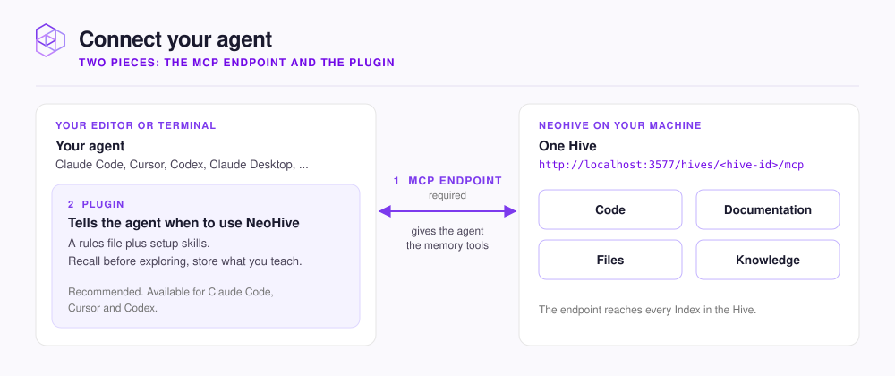

# Connect your agent

Every agent needs the hive's MCP endpoint. Claude Code, Cursor, and Codex also get a plugin that tells them when to use it.

<figure><figcaption></figcaption></figure>

| Agent | Page | What you set up |
|---|---|---|
| **Claude Code** | [Claude Code](claude-code.md) | `claude mcp add`, then the NeoHive plugin |
| **Cursor** | [Cursor](cursor.md) | `.cursor/mcp.json`, then the NeoHive plugin |
| **Codex** | [Codex](codex.md) | `~/.codex/config.toml`, then the NeoHive plugin |
| **Claude Desktop** or any other MCP app | [Claude Desktop and other MCP apps](desktop-apps.md) | The endpoint, or `mcp-remote` for apps that only run local commands |

## Where to copy the endpoint

Open the hive in the dashboard. The **Install Instructions** panel is open until an agent connects; after that, click **Install** or **Reinstall** to open it. Pick your agent, and the commands come filled in:

```text
http://localhost:3577/hives/<hive-id>/mcp
```

The host is the address you opened the dashboard on, so a shared server shows its own address. The configs also send an `x-mcp-client` header naming your agent, which is how the panel shows which agents are connected and when each last made a request.

Keep `neohive` in the server name the dashboard gives you. The plugins find the hive by looking for an MCP server whose name contains `neohive`.

## Tell your agent to use NeoHive

The plugins add these instructions for you. Without a plugin, paste this into your agent's rules file (`CLAUDE.md`, `AGENTS.md`, or its system prompt) and adjust it to what your team wants kept:

```text
## NeoHive

- At the start of every session, call `memory_context` with a short description of the task, for example "adding rate limits to the Express gateway". It loads the conventions and decisions that apply.
- Before reading many files to learn how something works, call `memory_recall` with specific terms, for example "payment retry handler". The indexed code often answers it directly.
- When I correct you, set a convention, or point out a gotcha, call `memory_store`. Write one self-contained statement with the terms a later search would use and the reason behind it.
- If more than one hive is connected and you are unsure which one a memory belongs in, ask before storing.
```

## Next step

[Claude Code](claude-code.md)
