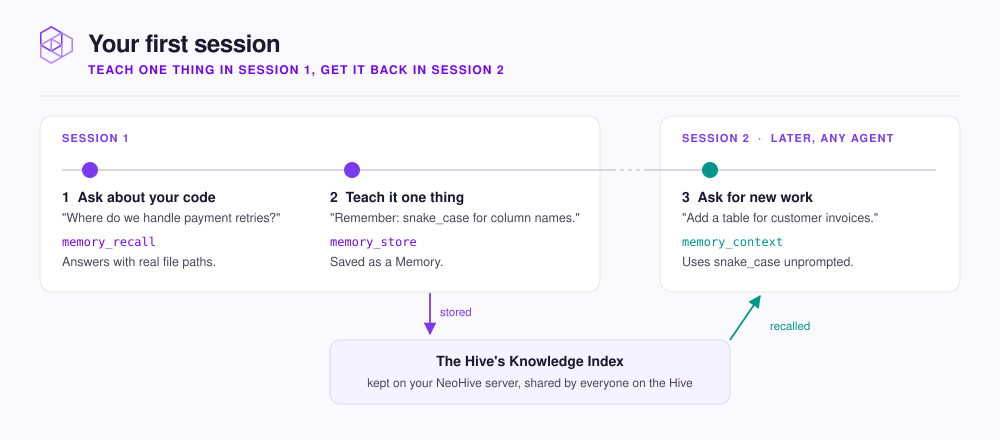

# Your first session

Three prompts show what NeoHive changes: answers from your code, a convention your agent keeps, and recall in a later session.

<figure><figcaption></figcaption></figure>

**You need:** an agent connected to a hive (see [Connect your agent](connect/README.md)) and a **Code** index whose first sync has finished.



## Ask about your code

Ask something only your repository can answer:

```text
Where do we handle payment retries?
```

Your agent calls `memory_recall` and answers from the indexed code, with real file paths. You do not paste files into the chat.



## Teach it one thing

Tell it a convention it cannot work out from the code:

```text
Remember that we always use snake_case for database column names.
```

It calls `memory_store`, which saves the convention as a memory in the hive's **Knowledge** index.



## See it come back

Close the session and start a new one. Ask for work the convention applies to:

```text
Add a table for customer invoices.
```

Your agent calls `memory_context` or `memory_recall`, gets the convention back, and uses snake_case without being told. With a NeoHive plugin, it loads this context at the start of the task on its own.



The memory belongs to the hive, not to your agent. A teammate who connects Cursor or Codex to the same hive gets the same convention back.


If the agent answers without calling a NeoHive tool, say `Check NeoHive before answering.` The rules in [Connect your agent](connect/README.md) make that the default.


## Next step

[How NeoHive works](../concepts/how-it-works.md)
