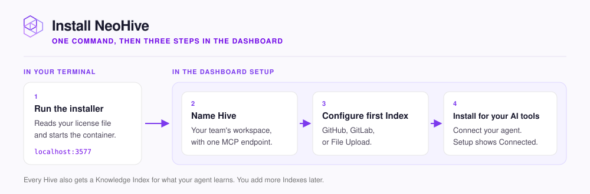

# Install NeoHive

This page has three steps, and each step ends with a check you can run. When you finish, your agent answers questions from your own code.

<figure><figcaption></figcaption></figure>

Before you start, you need the following:

* Docker 20 or later, installed and running on Linux, macOS, or Windows with WSL2.
* Port `3577` free on the machine.
* A NeoHive license file (`license.key` or `license.json`) from the [NeoHive team](https://www.neohive.ai/download/). [Licensing](../admin/licensing.md) explains how to get one.



## Install

Run the installer from the folder that holds your license file. The installer reads the license, and then starts NeoHive in a Docker container named `neohive`. If the installer cannot find the license file, it asks for the path.

```bash
bash <(curl -fsSL https://raw.githubusercontent.com/NeoHiveAI/install/main/install.sh)
```

When the installer finishes, it prints two dashboard addresses: `On this machine` and `From another host`. On a shared server, use the `From another host` address.

<details>

<summary>Optional: point to the license file, use another port, or force the CPU backend</summary>

To give the installer the license file path at the start, run the following command:

```bash
bash <(curl -fsSL https://raw.githubusercontent.com/NeoHiveAI/install/main/install.sh) \
  --license-file /path/to/license.key
```

You can also set `NEOHIVE_LICENSE_FILE=/path/to/license.key` before the command. The result is the same.

If port `3577` is already in use, set `NEOHIVE_PORT=3600` (or any free port) before the command. Then use that port wherever these docs say `3577`.

The installer looks for a GPU that supports CUDA, ROCm, or Vulkan. If it finds none, the installer uses the CPU. On an arm64 machine, including an Apple Silicon Mac, the installer skips GPU detection and always uses the CPU backend. On an Apple Silicon Mac, the installer also sets up a small native worker that runs on the Metal GPU. For details, see [GPU and CPU](../admin/gpu-cpu.md). If the backend that the installer picks fails, run the installer again with the CPU backend:

```bash
NEOHIVE_BACKEND=cpu bash <(curl -fsSL https://raw.githubusercontent.com/NeoHiveAI/install/main/install.sh)
```

</details>


**Check:** NeoHive is running.

```bash
curl http://localhost:3577/health
```

The reply contains `"status":"ok"`. If the reply does not contain `"status":"ok"`, run `docker logs neohive --tail 50` and then see [Common errors](../troubleshooting/common-errors.md).




## Create your Hive

A [Hive](../concepts/glossary.md#hive) is a workspace for one team or product. A Hive holds [Indexes](../concepts/glossary.md#index), the stores for your code, documents, files, and [Memories](../concepts/glossary.md#memory). To create your Hive, do the following:

1. Open the dashboard.
2. To accept the license, select **I Understand**.
3. Select **Get Started**, and then select **Start setup**.
4. Under **Hive name**, type a name, and then select **Continue**.
5. Under **Where does your data live?**, select the first source for the Hive.
6. Fill in the details for that source, and then select **Continue**.

The following table shows what you can add from each source and what you need for it:

| Source | Content you can select | What you need |
|---|---|---|
| **GitHub** | **Code** or **Documentation** from a repository | A GitHub personal access token |
| **GitLab** | **Code** or **Documentation** from a repository | A GitLab personal access token |
| **File Upload** | Markdown, text, and PDF files | The files |

For the scopes each token needs, see [Add a connection](../admin/data-sources.md#add-a-connection). For the file types and size limits, see [Supported file types](../reference/file-types.md).

The **Jira** card is marked **Coming soon**, and you cannot select it. NeoHive also gives every Hive a **Knowledge** Index, which stores the Memories your agent saves. You can add more Indexes later from the Hive page. To decide which Indexes to add, see [What to add, and where](../context/what-to-add.md).


**Check:** the Index is ready.

Open the Index from the Hive page. For a repository Index, **Sync history** shows that the first sync finished. If the sync failed, see [Repository sync issues](../troubleshooting/sync.md).




## Connect your agent

The last setup step is **Install for your AI tools**. Later, the **Install Instructions** panel on the Hive page shows the same commands. The first command registers the Hive as an [MCP](../concepts/glossary.md#mcp) server, so your agent can call NeoHive's tools. For Claude Code, run the first command in your terminal, from your project's root folder:

```bash
claude mcp add <name> '<hive-url>' \
  --scope project \
  --transport http \
  --header 'x-mcp-client: claude-code'
```

The `--scope project` flag saves the Hive in that folder's `.mcp.json`, where the plugin's automatic recall looks for it. Claude Code asks you to approve the server the next time it starts in the project. To learn why the scope matters, see [Connect Claude Code](connect/claude-code.md).

Then run the remaining commands inside Claude Code:

```text
/plugin marketplace add NeoHiveAI/NeoHiveClaude
/plugin install neohive@neohive-claude
/reload-plugins
/neohive:getting-started
```

To connect a different agent, see [Cursor](connect/cursor.md), [Codex](connect/codex.md), or [Claude Desktop and other MCP apps](connect/desktop-apps.md).


**Check:** your agent answers from your content.

Ask your agent a question that only your content can answer, such as `How does the authentication middleware work?`

The agent calls `memory_recall` and cites real paths from your repository or files. If the `memory_recall` tool is missing, see [Agent can't connect](../troubleshooting/connection.md). If the answer is vague, see [Recall isn't finding what I need](../troubleshooting/recall.md).




## Next step

Your agent is connected, so you can skip the pages for each agent. Continue with [Your first session](first-session.md).
