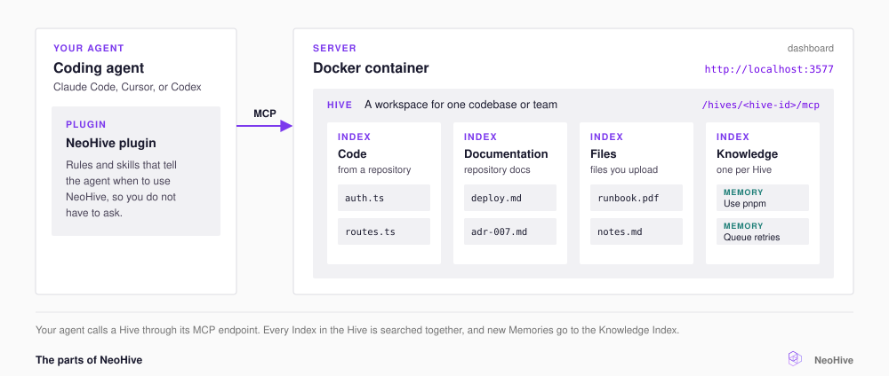

# What is NeoHive?

NeoHive is a self-hosted memory that your team's coding agents share, such as Claude Code, Cursor, and Codex. NeoHive is not an agent itself. It gives your agents your code and your team's knowledge, from a server you run yourself.

A coding agent starts each session with no knowledge of your project. It does not know how your code is organized or which conventions your team follows. It does not remember what you told it yesterday. As a result, you explain the same things again and correct the same mistakes.

NeoHive keeps that context for the agent, in a [Hive](../concepts/glossary.md#hive), a workspace for one team or product. NeoHive copies your repositories and documents into [Indexes](../concepts/glossary.md#index), the searchable stores inside a Hive. The agent then finds code by what it does, not by its file name. NeoHive also stores what your team teaches the agent, such as a convention or a bug fix. Each stored lesson is a [Memory](../concepts/glossary.md#memory).

NeoHive gives the agent only the context that the current task needs. When the agent needs context, it asks NeoHive through [MCP](../concepts/glossary.md#mcp), and NeoHive returns just the matching parts. The agent no longer loads a whole context file of thousands of lines. That leaves more of the agent's context window, the text it can read at once, for your actual work.

You run NeoHive yourself, so your code, documents, and Memories stay on a machine you control. For the details, see [What stays on your machine](../security/local-only.md). NeoHive runs in a Docker container, either on your own machine or on a shared server for your team. The same container serves a dashboard, where you manage your Hives and their content in your browser. [How NeoHive works](../concepts/how-it-works.md) shows how these parts fit together.

<figure><figcaption></figcaption></figure>

## The parts

NeoHive is made of the following parts. For the full explanation of Hives, Indexes, Memories, and the kinds of Index, see [Hives, Indexes, and Memories](../concepts/hives-indexes-memories.md).

| Part | What it is |
|---|---|
| **Server** | A Docker container on your machine or a shared server. The dashboard runs at `http://localhost:3577`. |
| **Hive** | A workspace for one team or product. Each Hive has one MCP endpoint that agents connect to. |
| **Index** | A searchable store inside a Hive. Each Index holds one kind of content, such as your code, your docs, or your team's Memories. |
| **Memory** | One lesson your team teaches the agent, such as a convention, a decision, or the fix for a bug. NeoHive keeps each Memory, so any agent connected to the Hive can use the lesson in a later session. |
| **Plugin** | Rules and skills for Claude Code, Cursor, or Codex. The plugin tells the agent when to use NeoHive, so you do not have to ask. |

<figure><figcaption></figcaption></figure>

## Who NeoHive is for

NeoHive is for anyone who works with an AI agent. You do not need to be a developer to use NeoHive. Claude Code, Cursor, and Codex each have a NeoHive plugin. Claude Desktop and any other app that supports MCP can connect too. One person sets up the NeoHive server, and everyone else connects their agent to it, as [Connect your agent](connect/README.md) explains.

NeoHive helps teams most, because everyone connected to the same Hive shares its Memories. A convention that one person teaches comes back for every teammate's agent, whichever tool they use. A teammate who joins later gets that knowledge on their first day. [Team workflows](../results/team-workflows.md) shows how teams set this up.

Developers get the most from NeoHive when a coding agent works in a codebase it does not know. NeoHive also helps when you correct the same mistakes again and again. If you work alone, run NeoHive on your own machine. Your agent then remembers your project from one session to the next.

## Next step

[Quickstart](quickstart.md)
