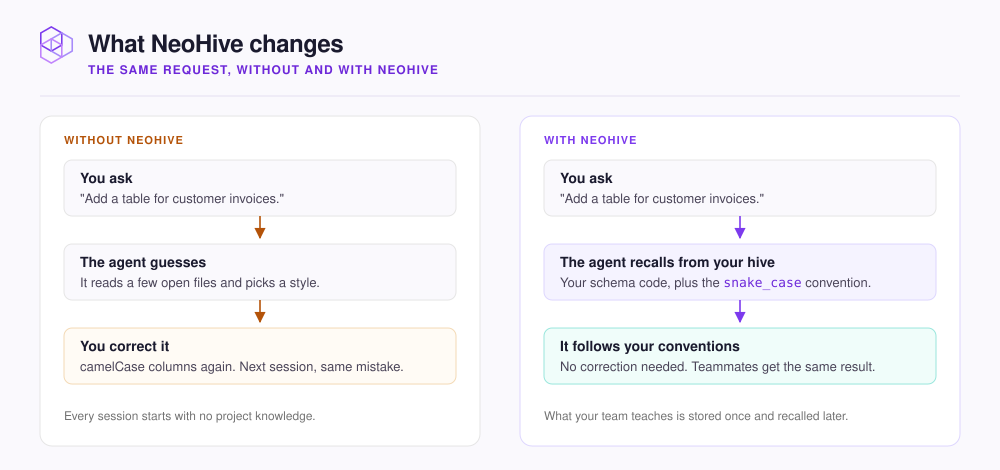

# What is NeoHive?

NeoHive is a memory server for coding agents such as Claude Code, Cursor, and Codex. It gives your agent your code and your team's knowledge, from a server you run yourself.

A coding agent starts each session with no knowledge of your project. It does not know how your code is organized or which conventions your team follows. It does not remember what you told it yesterday. As a result, you explain the same things again and correct the same mistakes.

NeoHive keeps that context for the agent, in a [Hive](../concepts/glossary.md#hive), a workspace for one team or product. NeoHive copies your repositories and documents into [Indexes](../concepts/glossary.md#index), the searchable stores inside a Hive. The agent then finds code by what it does, not by its file name. NeoHive also stores what your team teaches the agent, such as a convention or a bug fix. Each stored lesson is a [Memory](../concepts/glossary.md#memory).

When the agent needs context, it asks NeoHive through [MCP](../concepts/glossary.md#mcp). NeoHive returns only the parts that matter for the current task. The agent reads only what the task needs, not a whole context file of thousands of lines.

NeoHive runs in a Docker container, on your own machine or on a shared server for your team. You manage Hives and their content from a dashboard in your browser.

<figure><figcaption></figcaption></figure>

## The parts

| Part | What it is |
|---|---|
| **Server** | A Docker container on your machine or a shared host. The dashboard runs at `http://localhost:3577`. |
| **Hive** | A workspace for one team or product. Each Hive has one MCP endpoint that agents connect to. |
| **Index** | One content store in a Hive. A **Code** or **Documentation** Index comes from a GitHub or GitLab repository. You upload files to a **Files** Index. Every Hive also has one **Knowledge** Index, which holds its Memories. A **Shared Index** is an Index that another Hive already set up. |
| **Memory** | One stored convention, decision, or lesson. Agents save a Memory with `memory_store` and get the Memory back with `memory_recall` or `memory_context`. |
| **Plugin** | Rules and skills for Claude Code, Cursor, or Codex. The plugin tells the agent when to use NeoHive, so you do not have to ask. |

## Who NeoHive is for

NeoHive is for developers and teams who use coding agents every day. Any agent that supports MCP can connect.

NeoHive helps teams most. A convention that one person teaches comes back for everyone on the same Hive.

## What stays on your machine

NeoHive stores and searches your code, documents, and Memories on the machine it runs on. NeoHive does not send them to the NeoHive team or to a model provider.

The NeoHive server makes some outbound calls. The server checks your license, downloads its embedding model, and checks for updates. It also sends usage numbers that contain none of your content. Finally, it clones the repositories you connect. [What stays on your machine](../security/local-only.md) lists each call. Your agent's model provider still sees what NeoHive returns to the agent.

## Next step

[Quickstart](quickstart.md)
