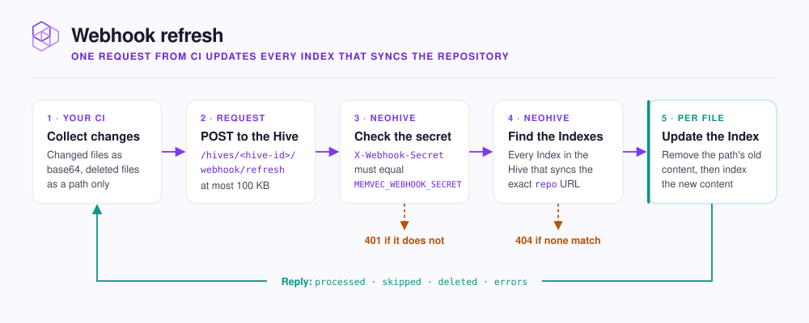

# Webhook refresh endpoint

Send changed files to NeoHive from your CI pipeline, so a Code or Documentation [Index](../concepts/glossary.md#index) updates seconds after a merge.

<figure><figcaption></figcaption></figure>

Scheduled syncs already keep each [Code](../concepts/glossary.md#code-index) or [Documentation Index](../concepts/glossary.md#documentation-index) current. Use the webhook only when the wait for the next scheduled sync is too long. To set the schedule, see [Keep a repository up to date](../context/repositories/sync.md).

```text
POST http://<host>:3577/hives/<hive-id>/webhook/refresh
Content-Type: application/json
X-Webhook-Secret: <secret>
```

`<hive-id>` is the id of your [Hive](../concepts/glossary.md#hive), the NeoHive workspace your agent connects to. The same id appears in the Hive's [MCP](../concepts/glossary.md#mcp) endpoint, `http://<host>:3577/hives/<hive-id>/mcp`. One request updates every Code or Documentation Index in that Hive that syncs the repository you name.

## Authentication

NeoHive compares `X-Webhook-Secret` with `MEMVEC_WEBHOOK_SECRET` on the `neohive` container. While that variable is unset, every request gets a `401` response. The installer does not set `MEMVEC_WEBHOOK_SECRET`, so add the variable to the container yourself. Add the variable again after each upgrade. [Environment variables](environment-variables.md) explains why.


Treat the secret like a database password. Keep the secret in your CI secret store. Never put it in the repository or in CI logs.


## Request body

```json
{
  "repo": "https://github.com/acme/api",
  "sha": "4f2c9e1",
  "files": [
    { "path": "src/users.ts", "content_base64": "ZXhwb3J0IGNvbnN0IC4uLg==" },
    { "path": "src/legacy.ts", "action": "deleted" }
  ]
}
```

| Field | Required | Notes |
|---|---|---|
| `repo` | Yes | The repository URL exactly as the Index stores it, such as `https://github.com/acme/api`. `acme/api` alone does not match. |
| `sha` | Yes | The commit the files come from. |
| `files[].path` | Yes | The file's path from the repository root. |
| `files[].content_base64` | For added and changed files | The whole file, base64-encoded. |
| `files[].action` | For deleted files | `deleted` is the only value that has an effect. |

For each path, NeoHive first removes the content it holds for that path. NeoHive then indexes `content_base64` if you sent it. **If you send a file with neither `content_base64` nor `"action": "deleted"`, NeoHive removes the file from the Index.** NeoHive does not read the file from its own copy of the repository.

The request body can be at most 100 KB. Base64 encoding makes each file about a third larger. Split a large change across several requests.

## How the webhook differs from a sync

The webhook indexes the files it receives immediately, but it works differently from a scheduled sync or **Trigger sync**:

- **The webhook ignores your file filters.** NeoHive still applies the built-in skip list, but not the Index's **Allowlist** or **Blocklist**. NeoHive indexes a file sent through the webhook even when your filters exclude it. To keep a file out of the Index, leave it out of the request.
- **The webhook does not start a sync.** **Sync history** shows no row for a webhook request. To see what a request did, read its response.

For how the filters work, see [File pattern syntax](file-patterns.md).

## Response

A successful request returns counts like the following:

```json
{ "processed": 2, "skipped": 0, "deleted": 7, "errors": [], "duration_ms": 412 }
```

| Field | Counts |
|---|---|
| `processed` | Files indexed, plus files removed with `"action": "deleted"` |
| `skipped` | Files the built-in skip list excludes, files that look binary, and files sent with no content |
| `deleted` | Stored pieces removed, not files |
| `errors` | One `{ "path", "error" }` entry per file that failed |

A failed request returns one of the following statuses:

| Status | Body | Cause |
|---|---|---|
| `401` | `Invalid or missing webhook secret` | The header is wrong, or `MEMVEC_WEBHOOK_SECRET` is not set on the container. |
| `400` | `Missing required field: repo` (or `sha`, `files (array)`) | The body is missing a field. |
| `400` | `Each file must have a path string` | An entry in `files` has no `path`. |
| `404` | `No Index found syncing repo: <repo>` | No Code or Documentation Index in that Hive syncs that exact URL. |
| `404` | `Unknown Hive: <hive-id>` | The Hive id in the URL is wrong. |
| `413` | `Payload Too Large` (an HTML page, not JSON) | The body is over 100 KB. |
| `402` | `License check failed` | The license expired or failed validation. See [Licensing](../admin/licensing.md). |

## GitHub Actions template

The runner must be able to reach your NeoHive server. A GitHub-hosted runner cannot reach `localhost`, so use a self-hosted runner on the same network, or read [Exposing NeoHive beyond your network](../security/network.md) first.

The following workflow sends the files that changed in each push to `main`:

```yaml
name: NeoHive refresh

on:
  push:
    branches:
      - main

jobs:
  refresh:
    runs-on:
      - self-hosted
    steps:
      - uses: actions/checkout@v4
        with:
          fetch-depth: 2

      - name: Send changed files to NeoHive
        env:
          NEOHIVE_URL: ${{ secrets.NEOHIVE_URL }}
          NEOHIVE_HIVE_ID: ${{ secrets.NEOHIVE_HIVE_ID }}
          NEOHIVE_WEBHOOK_SECRET: ${{ secrets.NEOHIVE_WEBHOOK_SECRET }}
          REPO_URL: ${{ github.server_url }}/${{ github.repository }}
        run: |
          git diff --no-renames --name-status HEAD~1 HEAD > changed.txt
          python3 - > payload.json <<'EOF'
          import base64, json, os
          files = []
          for line in open("changed.txt"):
              status, path = line.rstrip("\n").split("\t", 1)
              if status == "D":
                  files.append({"path": path, "action": "deleted"})
              else:
                  with open(path, "rb") as f:
                      content = base64.b64encode(f.read()).decode()
                  files.append({"path": path, "content_base64": content})
          payload = {"repo": os.environ["REPO_URL"], "sha": os.environ["GITHUB_SHA"], "files": files}
          print(json.dumps(payload))
          EOF
          curl -fsS \
            -H 'Content-Type: application/json' \
            -H "X-Webhook-Secret: $NEOHIVE_WEBHOOK_SECRET" \
            --data @payload.json \
            "$NEOHIVE_URL/hives/$NEOHIVE_HIVE_ID/webhook/refresh"
```

`--no-renames` reports a renamed file as a deletion plus an addition, so NeoHive removes the old path from the Index. The template sends all changed files in one request. If the files add up to more than 100 KB, the request gets a `413` response.
