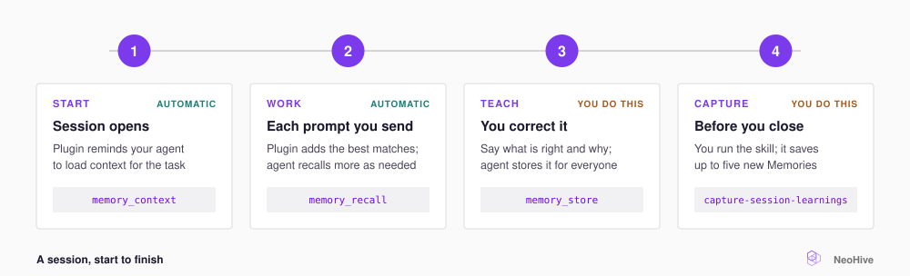

# A session, start to finish

A session has four stages. In Claude Code, the first two stages run automatically. You run the last two stages yourself.

<figure><figcaption></figcaption></figure>



## Start: load context for the task

When the session opens, the plugin's rules tell your agent to call `memory_context` with your task. `memory_context` returns your team's rules and conventions, plus the Memories that fit the task.

To load context yourself, or to reload it after you switch to a different task, run the following command:

```text
/neohive:load-context fixing the retry logic in the billing webhook handler
```

If you run the command without a task description, your agent describes the task from the conversation, or asks you to describe it.



## Work: your agent pulls what it needs

The plugin uses each prompt you send as a recall query. The plugin then adds the best matches to your agent's context. Your agent also calls `memory_recall` when it needs something specific. [What the plugin does automatically](plugin-automation.md) lists every trigger.



## Teach: correct your agent and tell it to remember

When your agent is wrong, give the correct answer and the reason for it. Your agent stores the correction with `memory_store`. Everyone who uses your [Hive](../concepts/glossary.md#hive) then gets the correction in later sessions.

```text
Remember that the payments API requires idempotency keys on every POST request.
```



## Capture: save the session's learnings

Before you close the session, run the following command:

```text
/neohive:capture-session-learnings
```

Your agent reviews the conversation for corrections, conventions, decisions, and known problems. Your agent skips what the Hive already knows and stores up to five new Memories.


No hook runs the capture for you. If you close the session without running the capture, NeoHive keeps only the Memories your agent stored during the session.


If your agent used memory poorly during the session, the capture skill can also add one instruction to your agent's instructions file. For example, the skill might add an instruction if your agent never loaded context. The skill edits only the memory section of that file.



## In Codex and Cursor

The Codex and Cursor plugins have no hooks, so nothing runs automatically. Each plugin's rules file tells your agent to call `memory_context` first. To run a skill, ask your agent to run it by name, for example `Run the load-context skill`.

| Agent | Start | Capture | Capture may edit |
|---|---|---|---|
| Claude Code | Automatic, or `/neohive:load-context` | `/neohive:capture-session-learnings` | `~/CLAUDE.md` |
| Codex | Rules file, or the `load-context` skill | The `capture-session-learnings` skill | `~/AGENTS.md` or `~/.codex/AGENTS.md` |
| Cursor | Rules file, or the `load-context` skill | The `capture-session-learnings` skill | Your `.cursor/rules/*.mdc` files, or the plugin's `rules/neohive.mdc` if you have none |

## Next step

Continue to [Teach your agent as you work](teach.md).
