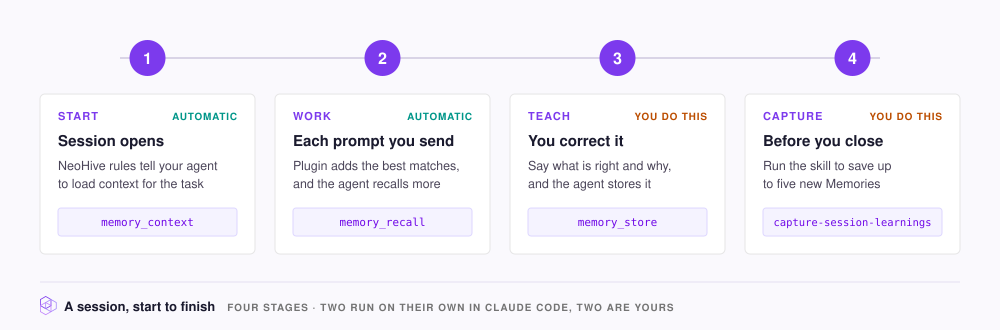

# A session, start to finish

A session is one conversation with your agent, from your first prompt until you close it. Your agent starts each session knowing nothing about your project. With NeoHive, your agent loads your team's context from your [Hive](../concepts/glossary.md#hive) and saves what you teach it for later sessions.

A session has four stages. In Claude Code, the first two run automatically, and you run the last two yourself. The following diagram shows each stage:

<figure><figcaption></figcaption></figure>



## Start: load context for the task

When the session opens, the plugin reminds your agent to call `memory_context` with your task. `memory_context` returns your team's rules and conventions, plus the [Memories](../concepts/glossary.md#memory) that fit the task.

To load context yourself, or to reload it after you switch to a different task, run the following command:

```text
/neohive:load-context fixing the retry logic in the billing webhook handler
```

If you run the command without a task description, your agent describes the task from the conversation, or asks you to describe it.



## Work: your agent pulls what it needs

The plugin runs a [recall](../concepts/glossary.md#recall) with each prompt you send and adds the best matches to your agent's context. Your agent also calls `memory_recall` itself when it needs something specific. For more information about what triggers a recall, see [What the plugin does automatically](plugin-automation.md).



## Teach: correct your agent and tell it to remember

When your agent gets something wrong, give the correct answer and the reason:

```text
Remember that the payments API requires idempotency keys on every POST request.
```

Your agent stores the correction with `memory_store`, and everyone who uses your Hive gets it in later sessions. For more information about what to say, see [Teach your agent as you work](teach.md).



## Capture: save the session's learnings

To save the session's learnings, run the following command before you close the session:

```text
/neohive:capture-session-learnings
```

Your agent reviews the conversation for corrections, conventions, decisions, and known problems. It skips what the Hive already knows and stores up to five new Memories.


No hook runs the capture for you. If you close the session without running the capture, NeoHive keeps only the Memories your agent stored during the session.


The capture can also add one instruction to your agent's instructions file when your agent used memory poorly. For example, the capture adds an instruction when your agent never loaded context. The capture changes only the memory section of that file.



## Commands for each agent

What you run depends on your agent:



The plugin reminds your agent to load context when the session opens. To reload context for a new task, run `/neohive:load-context`. Before you close the session, run `/neohive:capture-session-learnings`. The capture can edit `~/CLAUDE.md`.



The Codex plugin has no hooks, so nothing runs on its own. Its rules file tells your agent to load context first. To run a skill, ask your agent for it by name.

To load context, ask your agent to "Run the load-context skill." Before you close the session, ask your agent to "Run the capture-session-learnings skill." The capture can edit `~/AGENTS.md` or `~/.codex/AGENTS.md`.



The Cursor plugin has no hooks, so nothing runs on its own. Its rules file tells your agent to load context first. To run a skill, ask your agent for it by name.

To load context, ask your agent to "Run the load-context skill." Before you close the session, ask your agent to "Run the capture-session-learnings skill." The capture can edit your `.cursor/rules/*.mdc` files, or the plugin's `rules/neohive.mdc` if you have none.


