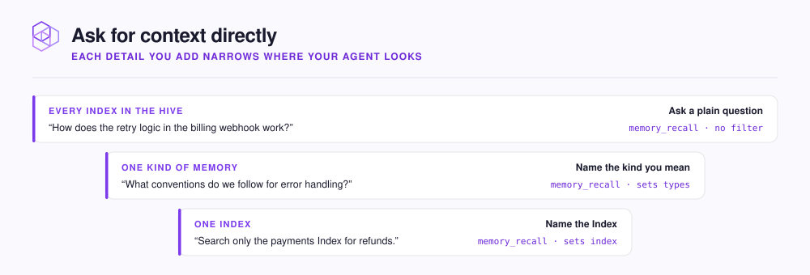

# Ask for context directly

A [Hive](../concepts/glossary.md#hive) is your team's workspace in NeoHive. The Hive holds your code and documents, plus the [Memories](../concepts/glossary.md#memory) your team has taught its agents.

Your agent searches the Hive on its own when its rules tell it to. You can also ask your agent directly what the Hive knows. Ask before your agent writes any code. Your agent then starts from your team's decisions and known problems, instead of guessing.

The following table pairs common questions with the tool your agent calls for each one. To narrow a question to one kind of Memory or one [Index](../concepts/glossary.md#index), see [Narrow the ask](#narrow-the-ask).

| You want | Ask something like | Your agent calls |
|---|---|---|
| What the team knows before you start | `Before we start, what do we know about the auth flow in the gateway?` | `memory_context` |
| Whether the team has seen a problem before | `Have we hit flaky failures in the batch processor before? What fixed them?` | `memory_recall` |
| The rules for an area | `What conventions do we follow for error handling in the API layer?` | `memory_recall`, limited to conventions |
| How a piece of code works | `How does the retry logic in the billing webhook work?` | `memory_recall`, then reads the files that the results point to |
| Which Indexes your agent can search | `List my NeoHive indexes.` | `list_indexes` |

## Narrow the ask

An Index is one store of context inside a Hive, such as your code or your team's Memories. By default, your agent searches every Index in the Hive. Each detail you add limits where your agent searches.

<figure><figcaption></figcaption></figure>

| Say | Your agent narrows the search to |
|---|---|
| "conventions", "rules", "what must we always do" | Directives and conventions |
| "have we hit this before", "known gotchas" | Insights and error patterns |
| "why did we choose" | Decisions |
| "search only the payments Index" | One Index. Your agent finds the Index ID with `list_indexes`. |

For the full list of Memory types, see [Memory types](../reference/memory-types.md).


If the first answer does not have what you need, ask again with different words. Two phrasings of the same idea often return different Memories.

