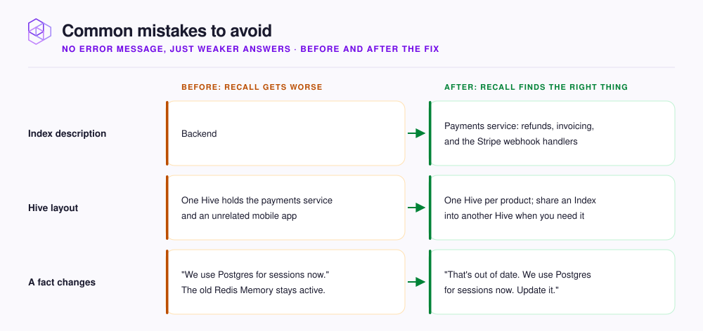

# Common mistakes to avoid

None of the mistakes on this page shows an error message. NeoHive keeps working, but it returns weaker answers. The [Glossary](../concepts/glossary.md) defines the Hive, Index, and Memory terms that this page uses.

<figure><figcaption></figcaption></figure>

| Mistake | What you notice | Fix |
|---|---|---|
| **Index with an empty or vague description** | Your agent searches the wrong Index, or every Index, when you ask about one area. | On the Index page, fill in **Description** under **Index settings**. Your agent reads the description in `list_indexes`. |
| **Unrelated codebases in one Hive** | Answers include code and conventions from another product. | Give each product its own Hive. To reuse an Index elsewhere, add it to the other Hive as a **Shared Index**. |
| **Indexing everything the defaults allow** | Generated code, snapshot fixtures, and CSV or JSON data fill results that should show your source code. | Set an **Allowlist** for the folders you work in. Then set a **Blocklist** for files to leave out inside those folders. |
| **Never correcting the agent** | The same wrong suggestion comes back in every session. | When your agent is wrong, say what is correct and why. |
| **Stating a new fact without retiring the old one** | Your agent quotes the old rule as often as the new one. | Say "that's out of date" so your agent deactivates the old Memory. |
| **One session across unrelated tasks** | Loaded context fits the task you started with, not the task you are working on now. | Start a new session, or run `/neohive:load-context` with the new task. |
| **Skipping the end-of-session capture** | Your agent never recalls decisions from long sessions. | Run `/neohive:capture-session-learnings` before you close the session. |
| **Wrong Model Context Protocol (MCP) server name or scope** | In Claude Code, prompts stop adding context automatically. Tool calls still work. | Keep `neohive` in the server name. Add the server with `--scope user` or `--scope project`. See [What the plugin does automatically](plugin-automation.md). |

## What NeoHive already skips

NeoHive never indexes the following files and folders, so you do not need to block them. NeoHive skips folders named `node_modules`, `dist`, `build`, `vendor`, `coverage`, `venv`, or `__pycache__`. It skips the lock files `package-lock.json`, `yarn.lock`, `pnpm-lock.yaml`, and `.terraform.lock.hcl`. It also skips minified `.min.js` and `.min.css` files, images, and binaries. [Choose which files are included](../context/repositories/file-patterns.md) shows allowlist and blocklist patterns.


If you see an actual error, such as a failed sync or a tool your agent cannot find, see [Common errors](../troubleshooting/common-errors.md).


## Next step

Continue to [Dashboard tour](../admin/dashboard.md).
