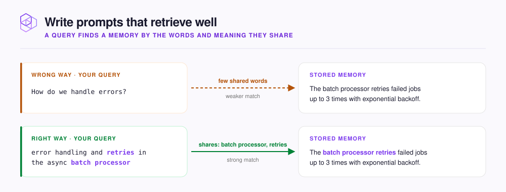

# Write prompts that retrieve well

Recall is how your agent searches your [Hive](../concepts/glossary.md#hive), your team's NeoHive workspace, for context. Your agent recalls when it calls `memory_recall` or `memory_context`. In Claude Code, the plugin also recalls with the start of each prompt you send.

Recall finds a stored [Memory](../concepts/glossary.md#memory), code, or a document by the words and meaning it shares with your query. A query that uses the same words as the answer finds the answer. A vague question shares few words with anything, so recall returns weak matches. [How retrieval works](../concepts/retrieval.md) explains how recall finds and ranks results.

This page shows how to phrase prompts and queries so recall returns what you need. In short, write the query the way the answer would be written.

<figure><figcaption></figcaption></figure>

| Instead of | Write | Why it works better |
|---|---|---|
| `How do we handle errors?` | `error handling and retries in the async batch processor` | A statement with system names reads like the Memory it should match. |
| `auth stuff` | `JWT validation and token refresh in the API gateway middleware` | The query names the parts a matching Memory would mention. |
| `duplicate prevention` | `idempotency keys on payment POST requests` | The query uses your team's own words, which stored Memories also use. |
| `ok now do the search work` | `Switching to the search indexing worker. It drops documents over 1MB.` | The prompt starts with the subject, so the automatic recall has something to match. |

## Put the subject first

In Claude Code, the plugin recalls with only the start of each prompt, as [What the plugin does automatically](plugin-automation.md) explains. Put the system and the problem first. Then add background and instructions.

## Ask for several phrasings on important searches

`memory_recall` accepts `queries`, a list of phrasings whose results it merges into one list. [MCP tools](../reference/mcp-tools.md#memory_recall) lists its parameters and limits. Use `queries` when you do not know the words your team uses.

```text
Search memory a few different ways for how we rate-limit the billing API.
```

## Pick the right tool

Call `memory_context` once at the start of a task, and `memory_recall` any time you need something specific. [MCP tools](../reference/mcp-tools.md) lists the parameters of each tool.

Both tools search every [Index](../concepts/glossary.md#index) in your Hive unless you pass `index`. Each Index is one store of context inside the Hive. Describe the task as a statement. For example, `implementing rate limiting for the Express gateway` loads more context than `what do we know about the gateway?`.

If your agent has no NeoHive plugin, paste the rules in [Tell your agent to use NeoHive](../get-started/connect/README.md#tell-your-agent-to-use-neohive) into its rules file.


Before you rely on a phrasing, test it in the dashboard **Playground**. See [Test queries in the Playground](../admin/playground.md).

