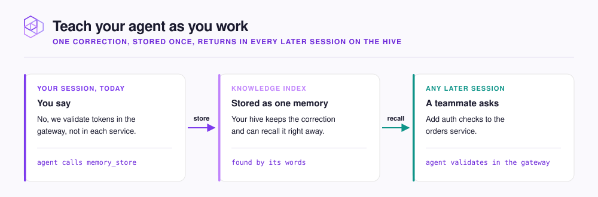

# Teach your agent as you work

Tell your agent something once, in plain words. Your agent stores what you said as a [Memory](../concepts/glossary.md#memory) (a stored piece of knowledge) for everyone who uses your [Hive](../concepts/glossary.md#hive).

<figure><figcaption></figcaption></figure>

| When this happens | Say something like | Your agent |
|---|---|---|
| Your agent gets something wrong | `No, we validate tokens in the gateway, not in each service.` | Stores the correction with `memory_store` |
| You make a decision | `Remember that we use Redis for sessions because they are short-lived and need no durability.` | Stores the decision, with the reason |
| You find a problem your team should avoid | `Store this: the staging database rejects connections without TLS.` | Stores the problem as an insight |
| A fact is out of date | `That's out of date. We moved sessions off Redis last month. Update it.` | Stores the new fact and deactivates the old one with `memory_forget` |

## Say it when it happens

Correct your agent while the reason is still in the conversation. The reason is what makes the Memory useful later. `/neohive:capture-session-learnings` finds what you missed. It stores at most five Memories per run.

## Name the system, the rule, and the reason

Recall finds a Memory by the words and meaning in it. A specific correction creates a specific Memory.

| Vague (hard to recall) | Specific (recalled reliably) |
|---|---|
| `We fixed the bug.` | `Retry calls to the billing API with exponential backoff from 500ms, at most 3 attempts. The provider returns 429 with no Retry-After header.` |
| `Don't use the old client.` | `Use the v2 HTTP client in lib/http for all outbound calls. The v1 client has no request timeout and hangs workers.` |

## Say "out of date" when a fact changes

If you state only the new fact, both versions stay active. Your agent might then use either version. When you say "that's out of date", your agent deactivates the old Memory, so recall stops returning it. A deactivated Memory is switched off, not deleted.

## Where Memories go

Everything your agent stores goes into your own Hive's **Knowledge** [Index](../concepts/glossary.md#knowledge-index). Your agents can recall a new Memory immediately. Your agent never stores anything in a [Shared Index](../concepts/glossary.md#shared-index). A Shared Index belongs to another Hive, and your agents can only read from it.

To see stored Memories, do the following:

1. In the dashboard, open your Hive.
2. Select the **Recent learnings** tab.

The **Recent learnings** tab lists what agents stored in the last 7 days.

To import rules your team already keeps in `CLAUDE.md` or `AGENTS.md`, see [Migrate from CLAUDE.md](../context/migrate.md).

## Next step

Continue to [Ask for context directly](ask-directly.md).
