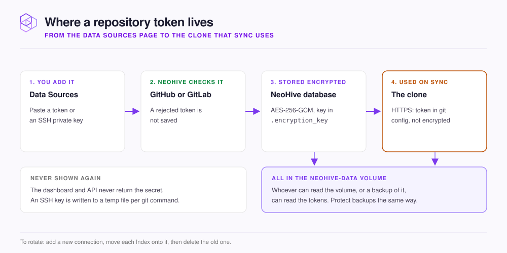

# Credentials and secrets

This page explains where NeoHive stores your data source tokens and how it protects them.

<figure><figcaption></figcaption></figure>

Each **connection** on the **Data Sources** page (`http://localhost:3577/sources`) holds one secret. The secret is one of the following:

- A GitHub or GitLab personal access token.
- A Jira API token or personal access token.
- An SSH private key for GitHub or GitLab.

| What | Where it lives | How it is protected |
|---|---|---|
| The token or SSH key | NeoHive's database in the `neohive-data` volume | NeoHive encrypts it with AES-256-GCM. The dashboard and API never show it |
| The encryption key | `/app/data/.encryption_key` in the same volume, created on first start | Only the file's owner can read it. If you start the container yourself, you can pass your own 64-hex-character key in `MEMVEC_ENCRYPTION_KEY` instead |
| The token, for HTTPS clones | The clone's git config under `/app/data/repos/` | NeoHive does not encrypt it |
| An SSH key during a git command | A temporary file inside the container | Only the file's owner can read it. NeoHive deletes the file when the command ends |


**Anyone who can read the `neohive-data` volume, or a backup of it, can read your tokens.** The volume holds the encrypted tokens, the key that decrypts them, and the plain token in each HTTPS clone. Protect backups as carefully as the tokens themselves. Give each token read-only scopes.


## Check, rotate, or remove a connection

NeoHive checks each new token with the provider before saving it. Each connection then shows **Valid**, **Invalid**, or **Unvalidated**. To check, rotate, or remove a connection, follow the steps in [Check or remove a connection](../admin/data-sources.md#check-or-remove-a-connection).

Deleting a connection removes only NeoHive's encrypted copy of the token. An existing clone still holds the token in its git config, so also revoke the token with the provider.


**Keep the encryption key with the data.** If `/app/data/.encryption_key` is lost, or `MEMVEC_ENCRYPTION_KEY` changes, NeoHive cannot decrypt the stored connections. You then need to add every connection again.

