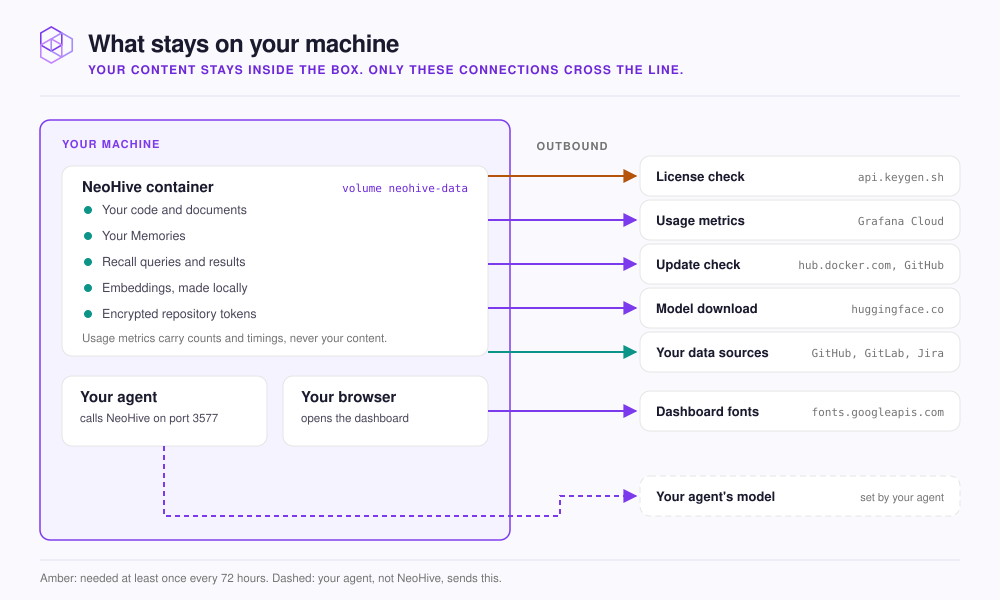

# What stays on your machine

You get every outbound connection NeoHive makes, what each one sends, and which ones you can block.

<figure><figcaption></figcaption></figure>

**What never leaves:** your code, documents, Memories, recall queries and repository tokens. Repositories are cloned, indexed and embedded on your machine and stored in the `neohive-data` Docker volume. NeoHive is not fully offline, though: the container makes the connections below.

## Outbound connections

| Connection | Goes to | When | What it sends | Can you turn it off? |
|---|---|---|---|---|
| License check | `api.keygen.sh` | At start, once a day, about every hour as a heartbeat, and when the container stops | Your license key, a random machine ID, and the container's platform and host name | No. See the warning below |
| Usage metrics | A Grafana Cloud OpenTelemetry endpoint | Continuously while turned on (the default), sent every minute | Metrics: request counts and timings, MCP tool names, Hive and Index IDs, counts of Memories, chunks and files, and Node.js runtime statistics. Traces: the name, duration and outcome of each request and tool call, with the request path and the error message when one fails. Both carry the NeoHive version, a hashed license ID and the random machine ID | Yes. Turn off **Share anonymous performance data with the NeoHive team** under **Anonymous Telemetry** on the **Settings** page. NeoHive keeps working |
| Update check | `hub.docker.com` and `raw.githubusercontent.com` | A minute after start, then once a day | Nothing. It reads the published version list and changelog | No setting. Block both hosts; the dashboard stops showing new versions |
| Model download | `huggingface.co` | When an embedding model or the PDF converter's model is not cached in the container yet, including the first use after an update replaces the container | Only the file request | No. It stops once the model is cached |
| Data sources | `github.com`, `api.github.com`, `gitlab.com`, your own GitLab host, or your Jira site | When you add a connection or an Index, on each sync or import, and when a connection is checked | Your stored token, to authenticate | Yes. Remove the Index and its connection |

Usage metrics never include file contents, Memory text, recall query text or tokens. A Memory's length is recorded, not its words.


**The license check needs the internet at least once every 72 hours.** If `api.keygen.sh` is unreachable, NeoHive keeps running for 72 hours from the last successful check, then stops at its next daily check. Allow outbound HTTPS to `api.keygen.sh` on a network with a strict firewall.


## Connections from other parts of your setup

These do not come from the container, but they involve NeoHive.

| Connection | Goes to | When |
|---|---|---|
| The installer | `raw.githubusercontent.com`, Docker Hub, `api.keygen.sh` | When you run `install.sh` to install or update |
| The dashboard's fonts | `fonts.googleapis.com`, `fonts.gstatic.com` | When your browser opens `http://localhost:3577` |
| Smart prompt rewriting | The Anthropic API, through the `claude` CLI | Only after you run `/neohive:enable-smart-prompts`. It sends your prompt and the recalled results so a small model can rewrite and filter them |

On a Mac with Apple silicon, the installer can run embedding in a separate NeoHive worker on the Mac itself, outside Docker. It still runs on your machine.

The Claude Code plugin writes a log of each session's NeoHive calls, including query text, to `~/.claude/neohive/sessions/` on your computer. It is not sent anywhere.


NeoHive returns context to your agent, and your agent sends it to its own model provider as part of the conversation. Your agent's provider decides what happens to it there, not NeoHive.


## Next step

Continue to [Credentials and secrets](credentials.md).
