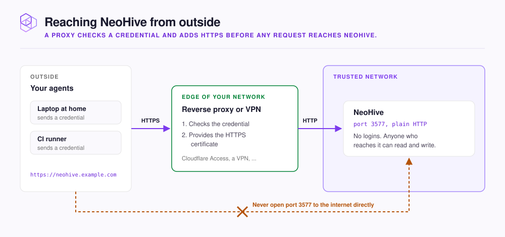

# Exposing NeoHive beyond your network

NeoHive runs as a server. Your agents and your browser reach NeoHive over the network on port `3577`. The dashboard and the endpoints your agents connect to all use that one port.

Other people may need NeoHive too, such as a teammate on your office network. You may also run an agent on a laptop outside that network. Each case needs a different setup.

This page shows the right setup for each case. The page also shows how to put a proxy in front of NeoHive. Then it shows how each agent sends the proxy's credential.

<figure><figcaption></figcaption></figure>

**NeoHive has no user accounts and checks no credentials.** Anyone who can reach port `3577` can read and write every [Hive](../concepts/glossary.md#hive) on the instance. A Hive is a workspace with its own [MCP](../concepts/glossary.md#mcp) endpoint. Your network is the access control.

| Who needs to reach NeoHive | What to set up |
|---|---|
| Only you, on this machine | Use the default install. If the host is on a shared network, block port `3577` from other machines |
| Your team, on a trusted network or VPN | Run NeoHive on a host that their machines can reach. See [Access and sharing](../admin/access.md) |
| Anyone outside a trusted network | Set up a reverse proxy that checks credentials and provides HTTPS. Never open port `3577` directly |

## The default install is reachable from your network

The installer publishes port `3577` on every network interface of the host, not only on `localhost`. Any machine that can route to the host can open the dashboard and the MCP endpoints. On an office network, a shared server, or a cloud virtual machine, block the port at your network firewall or cloud security group.


On Linux, Docker writes its own firewall rules for published ports. As a result, a `ufw` rule on the host does not block port `3577`. Block the port at the network edge instead.


## Put a proxy in front

NeoHive serves plain HTTP. For outside access, put a reverse proxy or VPN gateway in front of NeoHive. A reverse proxy is a server that receives each request and forwards it to NeoHive. Cloudflare Access and a company VPN are two examples of such gateways. The proxy checks a credential before any request reaches NeoHive. The proxy also provides the HTTPS certificate. Point your agents at the `https://` address that the proxy exposes, for example `https://neohive.example.com/hives/<hive-id>/mcp`.

## What NeoHive checks today

NeoHive does not check any token, password, or header on requests to the dashboard or the MCP endpoints. The one exception is the [webhook refresh endpoint](../reference/webhooks.md), which checks the `X-Webhook-Secret` header. Only the Claude Code plugin's hooks read the `NEOHIVE_TOKEN` variable. The hooks send the token on to your proxy. Only the proxy checks the credential.

## Pass the proxy's credential from each agent

Every MCP connection and the Claude Code hooks must send the header your proxy expects. The following examples use a bearer token stored in `NEOHIVE_TOKEN`.



```bash
export NEOHIVE_TOKEN="<your-token>"
claude mcp add neohive 'https://neohive.example.com/hives/<hive-id>/mcp' \
  --scope user \
  --transport http \
  --header "Authorization: Bearer $NEOHIVE_TOKEN" \
  --header 'x-mcp-client: claude-code'
```

Keep `NEOHIVE_TOKEN` exported where Claude Code runs. The hooks send it as `Authorization: Bearer $NEOHIVE_TOKEN`. The hooks find the endpoint only from an MCP server whose name contains `neohive`. That server must be in the project's `.mcp.json` or in the user-level servers of `~/.claude.json`.



Add the following entry to `.cursor/mcp.json`:

```json
{
  "mcpServers": {
    "neohive": {
      "url": "https://neohive.example.com/hives/<hive-id>/mcp",
      "headers": {
        "Authorization": "Bearer <your-token>",
        "x-mcp-client": "cursor"
      }
    }
  }
}
```



Add the following entry to `~/.codex/config.toml`:

```toml
[mcp_servers.neohive]
url = "https://neohive.example.com/hives/<hive-id>/mcp"
bearer_token_env_var = "NEOHIVE_TOKEN"
http_headers = { "x-mcp-client" = "codex" }
```



Desktop apps reach NeoHive through the `mcp-remote` bridge. Add each header with `--header`:

```json
{
  "mcpServers": {
    "neohive": {
      "command": "npx",
      "args": [
        "-y",
        "mcp-remote@latest",
        "https://neohive.example.com/hives/<hive-id>/mcp",
        "--header",
        "Authorization: Bearer <your-token>",
        "--header",
        "x-mcp-client: claude-desktop"
      ]
    }
  }
}
```




The hooks send only the `Authorization` header. Your proxy might need other headers, such as Cloudflare Access service-token headers. In that case, your agent's own tool calls still work. The automatic recall on each prompt does not reach NeoHive.


## Next step

If an agent cannot reach NeoHive after you set up the proxy, see [Agent can't connect](../troubleshooting/connection.md).
