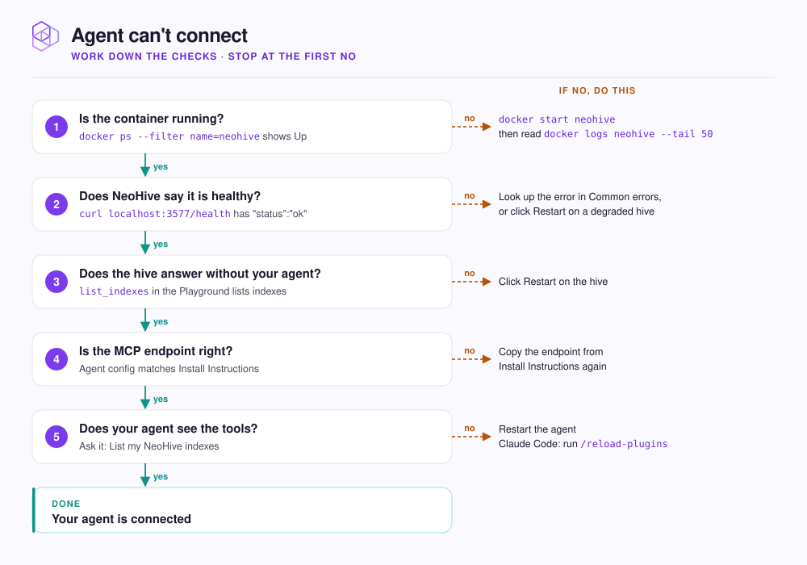

# Agent can't connect

Find where the link between your agent and NeoHive breaks, one check at a time.

<figure><figcaption></figcaption></figure>

Stop at the first check that fails and apply its fix.



## Is the container running?

```bash
docker ps --filter name=neohive
```

The `neohive` container shows a status of `Up`. If it is missing, start it and read why it stopped:

```bash
docker start neohive
docker logs neohive --tail 50
```

`No such container` means it was removed. Run the [installer](../get-started/install.md) again; your data stays in the `neohive-data` volume. If the start fails with `port is already allocated`, another program holds port `3577`. Stop it, or install on another port with `NEOHIVE_PORT=4577` and change the port in your agent's MCP endpoint.



## Does NeoHive say it is healthy?

```bash
curl http://localhost:3577/health
```

| Reply contains | Meaning | Fix |
|---|---|---|
| `"status":"ok"` | NeoHive is ready. | Go to the next check. |
| `"status":"error"` | NeoHive could not finish starting, or its embedding engine cannot run. | Look up the `error` text in [Common errors](common-errors.md). |
| `"status":"degraded"` | One hive failed its check. | On the dashboard home page, open that hive's menu and click **Restart**. |



## Does the hive answer without your agent?

Open **Playground** in the dashboard, choose your hive under **Hive**, set **Tool** to `list_indexes`, and click **Run**. A list of indexes means the hive works, so the fault is between it and your agent. An error means the hive itself is broken: click **Restart** on it, then run the check again.



## Is the MCP endpoint right?

Each hive has its own endpoint, `http://localhost:3577/hives/<hive-id>/mcp`. Open the hive in the dashboard, copy the endpoint from **Install Instructions**, and compare it with your agent's MCP config character by character.

A wrong hive id returns `Unknown Hive: <id>`. A wrong port or host returns a connection error. Once your agent reaches the hive, **Install Instructions** shows a `CONNECTED` count.



## Does your agent see the tools?

Ask your agent: `List my NeoHive indexes.` It calls `list_indexes` and answers. If it has no such tool, it has not loaded the MCP server: restart the agent after any config change. In Claude Code, run `/reload-plugins` if the `/neohive:` commands are missing.



## Still stuck?

Collect a diagnostics bundle and send it to `hello@neohive.ai` with what fails. The bundle holds logs and settings with secrets removed, never your memories, code, or databases.

```bash
curl -fsSL https://raw.githubusercontent.com/NeoHiveAI/install/main/logs.sh | bash
```

## Next step

Connected, but recall misses what you expect? See [Recall isn't finding what I need](recall.md).
